# Chapter 3 - Data Visualisation {-}


Load the libraries needed for these exercises.


```r
library(tidyverse)
```

## 3.2 - First Steps {-}

### Problem 1 {-}

Run `ggplot(data = mpg)`. What do you see?

We have a blank plot, since we have only constructed the initial plot object 
without any aesthetics.


```r
ggplot(data = mpg)
```


### Problem 2 {-}

How many rows are in `mpg`? How many columns?

There are 234 rows and 11 columns in the `mpg` data set.


```r
nrow(mpg)
```

```
## [1] 234
```

```r
ncol(mpg)
```

```
## [1] 11
```

### Problem 3 {-}

What does the `drv` variable describe? Read the help for `?mpg` to find out.

The variable `drv` describes the drive of the vehicle: f = front-wheel drive, 
r = rear wheel drive, 4 = 4wd.


```r
?mpg
```

### Problem 4 {-}

Make a scatter plot of `hwy` vs `cyl`.


```r
ggplot(mpg, aes(cyl, hwy)) +
  geom_point()
```


### Problem 5 {-}

What happens if you make a scatter plot of `class` vs `drv`? Why is the plot 
not useful?

Since `class` and `drv` are categorical variables, we don't see much of a 
meaningful relationship in the scatter plot.


```r
ggplot(mpg, aes(class, drv)) +
  geom_point()
```


## 3.3 - Aesthetic Mappings {-}

### Problem 1 {-}

What’s gone wrong with this code? Why are the points not blue?


```r
ggplot(data = mpg) + 
  geom_point(mapping = aes(x = displ, y = hwy, color = "blue"))
```


To set an aesthetic manually, it must go outside of `aes()`.


```r
ggplot(data = mpg) + 
  geom_point(mapping = aes(x = displ, y = hwy), color = "blue")
```


### Problem 2 {-}

Which variables in mpg are categorical? Which variables are continuous? 
(Hint: type ?mpg to read the documentation for the data set). How can you see 
this information when you run mpg?

We can use the `summary` function to see the mode of each variable.


```r
summary(mpg)
```

```
##  manufacturer          model               displ            year     
##  Length:234         Length:234         Min.   :1.600   Min.   :1999  
##  Class :character   Class :character   1st Qu.:2.400   1st Qu.:1999  
##  Mode  :character   Mode  :character   Median :3.300   Median :2004  
##                                        Mean   :3.472   Mean   :2004  
##                                        3rd Qu.:4.600   3rd Qu.:2008  
##                                        Max.   :7.000   Max.   :2008  
##       cyl           trans               drv                 cty       
##  Min.   :4.000   Length:234         Length:234         Min.   : 9.00  
##  1st Qu.:4.000   Class :character   Class :character   1st Qu.:14.00  
##  Median :6.000   Mode  :character   Mode  :character   Median :17.00  
##  Mean   :5.889                                         Mean   :16.86  
##  3rd Qu.:8.000                                         3rd Qu.:19.00  
##  Max.   :8.000                                         Max.   :35.00  
##       hwy             fl               class          
##  Min.   :12.00   Length:234         Length:234        
##  1st Qu.:18.00   Class :character   Class :character  
##  Median :24.00   Mode  :character   Mode  :character  
##  Mean   :23.44                                        
##  3rd Qu.:27.00                                        
##  Max.   :44.00
```

Or since the data frame is a tibble, just running `mpg` will show you the 
various variable types.


```r
head(mpg)
```

```
## # A tibble: 6 x 11
##   manufacturer model displ  year   cyl      trans   drv   cty   hwy    fl
##          <chr> <chr> <dbl> <int> <int>      <chr> <chr> <int> <int> <chr>
## 1         audi    a4   1.8  1999     4   auto(l5)     f    18    29     p
## 2         audi    a4   1.8  1999     4 manual(m5)     f    21    29     p
## 3         audi    a4   2.0  2008     4 manual(m6)     f    20    31     p
## 4         audi    a4   2.0  2008     4   auto(av)     f    21    30     p
## 5         audi    a4   2.8  1999     6   auto(l5)     f    16    26     p
## 6         audi    a4   2.8  1999     6 manual(m5)     f    18    26     p
## # ... with 1 more variables: class <chr>
```


### Problem 3 {-}

Map a continuous variable to color, size, and shape. How do these aesthetics 
behave differently for categorical vs. continuous variables?

Continuous variables will use a gradient to scale `color` and `size`, but will 
throw an error when applied to shape.


```r
ggplot(data = mpg, mapping = aes(x = cty, y = hwy, color = displ)) + 
  geom_point()
```


```r
ggplot(data = mpg, mapping = aes(x = cty, y = hwy, size = displ)) + 
  geom_point()
```

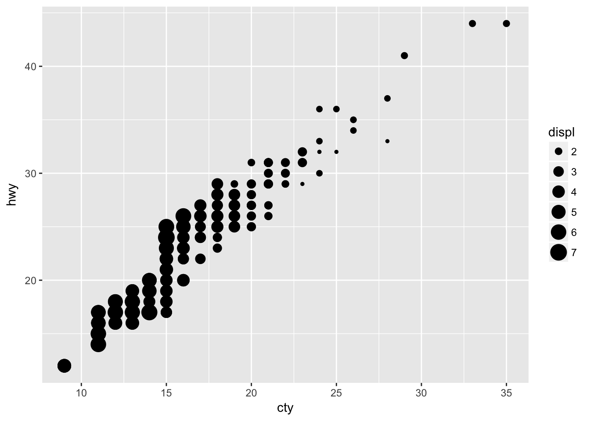


```r
p <- ggplot(data = mpg, mapping = aes(x = cty, y = hwy, shape = displ)) + 
  geom_point()
```


### Problem 4 {-}

What happens if you map the same variable to multiple aesthetics?

Mapping `displ` to `color` and `size` results in the following graph. Not 
necessarily helpful, but two ways of displaying the some variation.

```r
ggplot(data = mpg, mapping = aes(x = cty, y = hwy, color = displ, size = displ)) + 
  geom_point()
```


### Problem 5 {-}

What does the stroke aesthetic do? What shapes does it work with? 
(Hint: use ?geom_point)

The `stroke` aesthetic will modify the width of the border of a shape. From the 
documentation:


```r
ggplot(mtcars, aes(wt, mpg)) +
  geom_point(shape = 21, colour = "black", fill = "white", size = 5, stroke = 5)
```


### Problem 6 {-}

What happens if you map an aesthetic to something other than a variable name, 
like aes(colour = displ < 5)?

In this case the condition we pass to `color` returns a boolean that will map 
to `color`.

```r
ggplot(mtcars, aes(wt, mpg, color = disp < 100)) +
  geom_point()
```


## 3.5 Facets {-}

### Problem 1 {-}

What happens if you facet on a continuous variable?

The `facet_wrap` feature will still produce plots for each unique value.


```r
ggplot(mtcars, aes(disp, mpg)) +
  geom_point() +
  facet_wrap(~ wt)
```


### Problem 2 {-}

What do the empty cells in plot with `facet_grid(drv ~ cyl)` mean? How do they 
relate to this plot?

Empty cells occur when there are no observations within a specific combination 
of facet variables. We see in the below plot that there are no vehicles with 4wd 
and 5 cylinders.


```r
ggplot(data = mpg) + 
  geom_point(mapping = aes(x = drv, y = cyl))
```

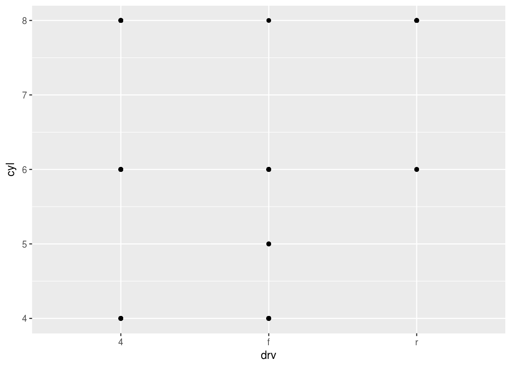

### Problem 3 {-}

What plots does the following code make? What does `.` do?

In the first example, using `.` allows us to plot a `facet_grid` without a 
column variable.

```r
ggplot(data = mpg) + 
  geom_point(mapping = aes(x = displ, y = hwy)) +
  facet_grid(drv ~ .)
```

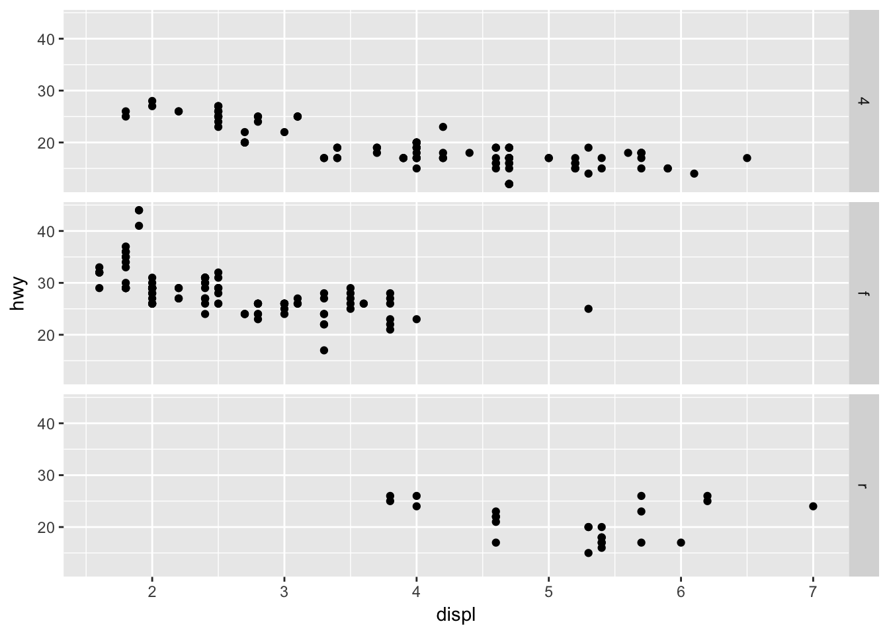

This is easier than trying to hack together a similar plot using `facet_wrap`.

```r
ggplot(data = mpg) + 
  geom_point(mapping = aes(x = displ, y = hwy)) +
  facet_wrap(~ drv, nrow = n_distinct(mpg$drv))
```


We can also use `.` to make a `facet_grid` while omitting a row variable.


```r
ggplot(data = mpg) + 
  geom_point(mapping = aes(x = displ, y = hwy)) +
  facet_grid(. ~ cyl)
```


### Problem 4 {-}

Take the first faceted plot in this section. What are the advantages to using 
faceting instead of the colour aesthetic? What are the disadvantages? How might 
the balance change if you had a larger dataset?

Faceting can make it easier to see the variation by `class` than using the color 
aesthetic, but can be unwieldy when the number of distinct values in `class` is 
large. For a larger dataset, faceting may be necessary, as the increased number 
of points may make it difficult to see a variation by color.


```r
ggplot(data = mpg) + 
  geom_point(mapping = aes(x = displ, y = hwy)) + 
  facet_wrap(~ class, nrow = 2)
```

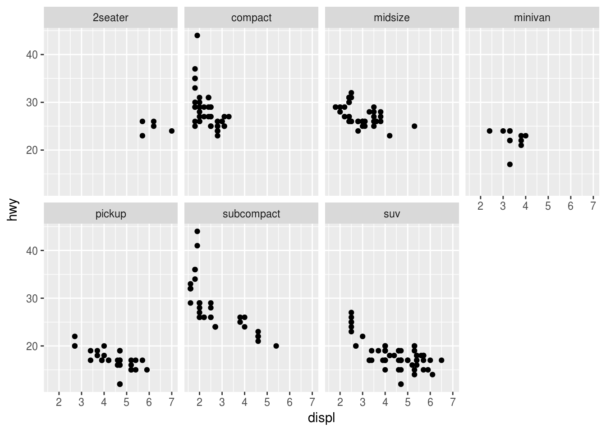

### Problem 5 {-}

Read ?facet_wrap. What does nrow do? What does ncol do? What other options 
control the layout of the individual panels? Why doesn’t facet_grid() have nrow 
and ncol arguments?

The `nrow` and `ncol` arguments allow you to control the number of rows or 
columns in the panel. There are a number of other arguments in `facet_wrap`:
  * `scales`: can fix scales or allow them to vary
  * `shrink`: shrink scales to fit output of statistics, not raw data
  * `labeller`: takes one data frame of labels and returns a list or data frame of character vectors
  * `as.table`: display facets as a table or a plot
  * `switch`: flip the labels
  * `drop`: drop unused factor lebels
  * `dir`: control direction of the panel
  * `strip.position`: control where to place the labels

The `facet_grid` function has `nrow` and `ncol` predefined by the faceting variables.

### Problem 6 {-}

When using facet_grid() you should usually put the variable with more unique 
levels in the columns. Why?

This will expand your panel vertically, making it easier to scroll through 
the grid.


```r
ggplot(data = mpg) + 
  geom_point(mapping = aes(x = displ, y = hwy)) +
  facet_grid(trans ~ drv)
```

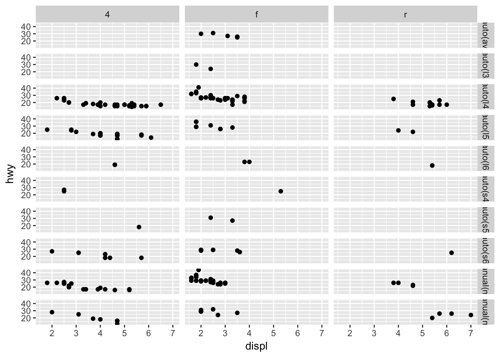


```r
ggplot(data = mpg) + 
  geom_point(mapping = aes(x = displ, y = hwy)) +
  facet_grid(drv ~ trans)
```

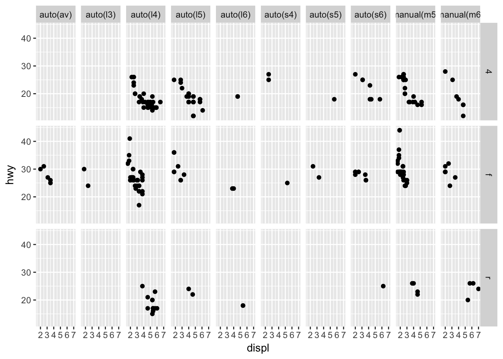

## 3.6 - Geometric Objects {-}

### Problem 1 {-}

What geom would you use to draw a line chart? A boxplot? A histogram? An area 
chart?

Use `geom_line` to draw a line chart.


```r
ggplot(economics, aes(date, unemploy)) + 
  geom_line()
```

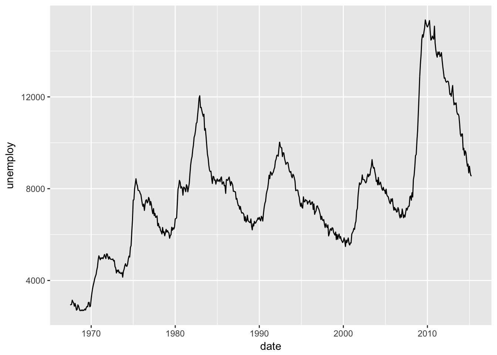

Use `geom_boxplot` to create a boxplot.


```r
ggplot(mpg, aes(x = class, y = hwy)) +
  geom_boxplot()
```


Use `geom_histogram` to create a histogram.


```r
ggplot(mpg, aes(x = hwy)) +
  geom_histogram()
```

```
## `stat_bin()` using `bins = 30`. Pick better value with `binwidth`.
```

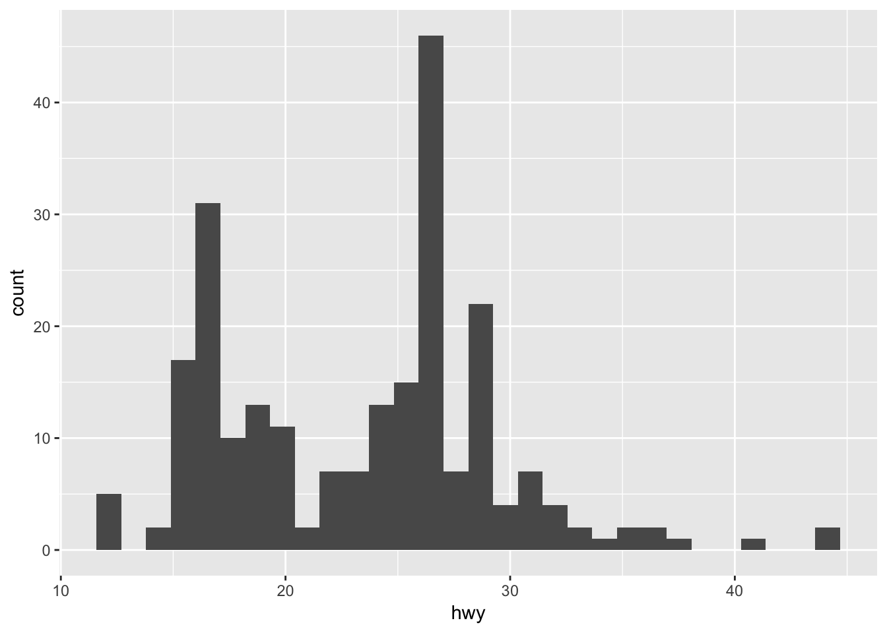

And use `geom_area` to create an area chart.


```r
ggplot(economics, aes(date, unemploy)) + 
  geom_area()
```


### Problem 2 {-}

Run this code in your head and predict what the output will look like. Then, 
run the code in R and check your predictions.

Be sure to think through the initial `ggplot` call and consider what will be 
passed to `geom_point` and `geom_smooth`.


```r
ggplot(data = mpg, mapping = aes(x = displ, y = hwy, color = drv)) + 
  geom_point() + 
  geom_smooth(se = FALSE)
```

```
## `geom_smooth()` using method = 'loess'
```


### Problem 3 {-}

What does `show.legend = FALSE` do? What happens if you remove it? Why do you 
think I used it earlier in the chapter?

The `show.legend` argument will can be used to map a layer to a legend. Setting 
to `FALSE` will remove that layer from the plot. 


```r
ggplot(data = mpg, mapping = aes(x = displ, y = hwy, color = drv)) + 
  geom_point(show.legend = FALSE) +
  geom_smooth(se = FALSE, show.legend = FALSE)
```

```
## `geom_smooth()` using method = 'loess'
```


But note that this only works by geom.

```r
ggplot(data = mpg, mapping = aes(x = displ, y = hwy, color = drv)) + 
  geom_point(show.legend = FALSE) + 
  geom_smooth(se = FALSE)
```

```
## `geom_smooth()` using method = 'loess'
```

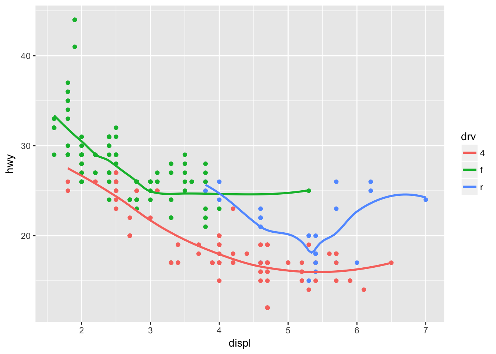

### Problem 4 {-}

What does the `se` argument to `geom_smooth()` do?

The `se` argument controls whether a confidence band is displayed around smooth. 
Note that the argument is set to `TRUE` by default.


```r
ggplot(data = mpg, mapping = aes(x = displ, y = hwy, color = drv)) + 
  geom_point(show.legend = FALSE) + 
  geom_smooth()
```

```
## `geom_smooth()` using method = 'loess'
```

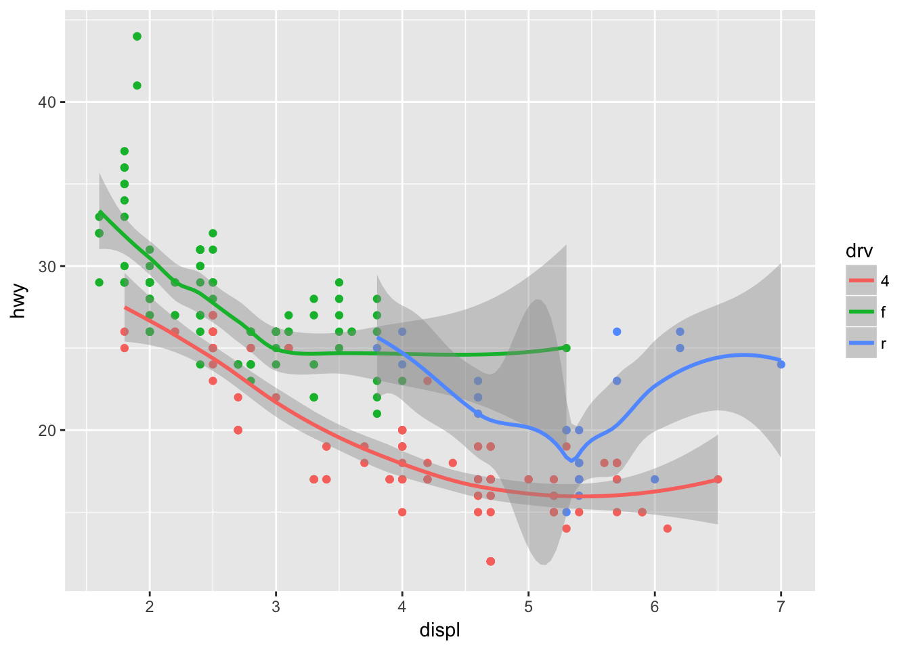

The `level` argument is used to control the confidence interval, and is set to 
0.95 by default.


```r
ggplot(data = mpg, mapping = aes(x = displ, y = hwy, color = drv)) + 
  geom_point(show.legend = FALSE) + 
  geom_smooth(level = 0.9999)
```

```
## `geom_smooth()` using method = 'loess'
```

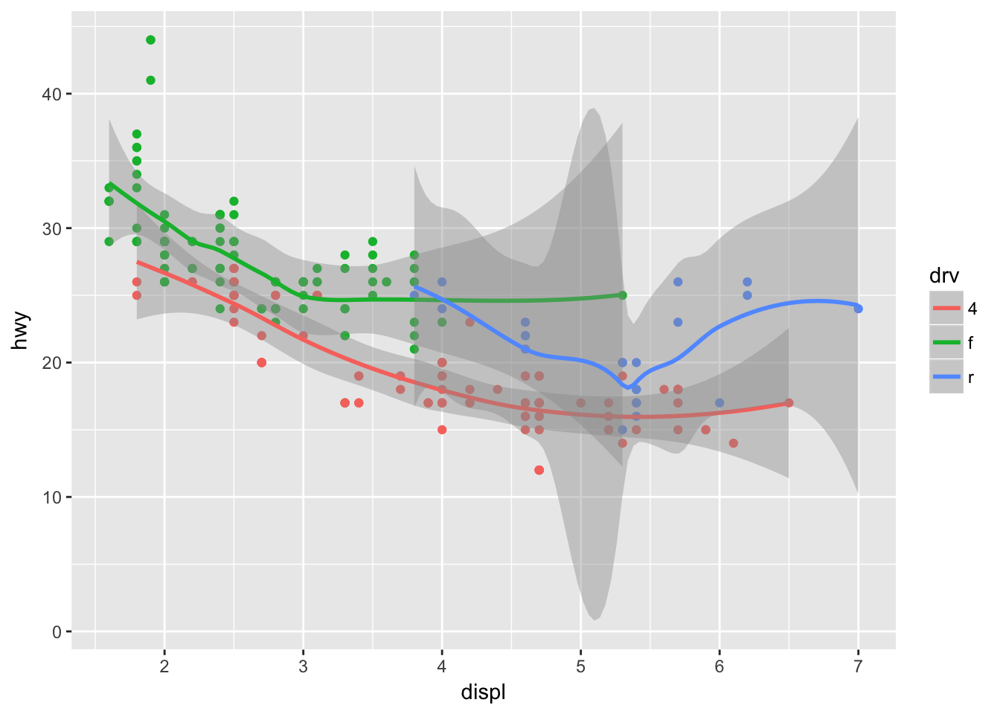

### Problem 5 {-}

Will these two graphs look different? Why/why not?

The graphs should look the same, as `data` and `aes` are inherited by 
`geom_point()` and `geom_smooth()` in the first example.


```r
ggplot(data = mpg, mapping = aes(x = displ, y = hwy)) + 
  geom_point() + 
  geom_smooth()
```

```
## `geom_smooth()` using method = 'loess'
```


```r
ggplot() + 
  geom_point(data = mpg, mapping = aes(x = displ, y = hwy)) + 
  geom_smooth(data = mpg, mapping = aes(x = displ, y = hwy))
```

```
## `geom_smooth()` using method = 'loess'
```

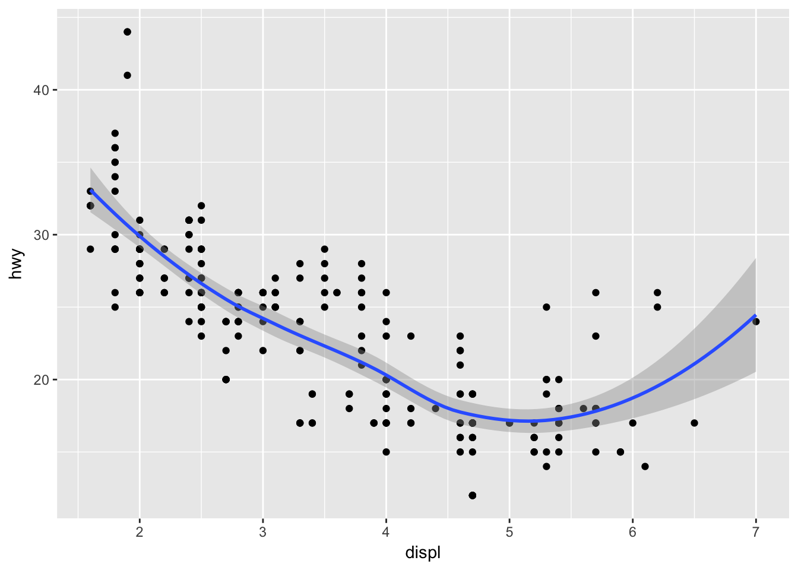

### Problem 6 {-}

Recreate the R code necessary to generate the following graphs.


```r
ggplot(data = mpg, mapping = aes(x = displ, y = hwy)) + 
  geom_point() + 
  geom_smooth(se = FALSE)
```

```
## `geom_smooth()` using method = 'loess'
```

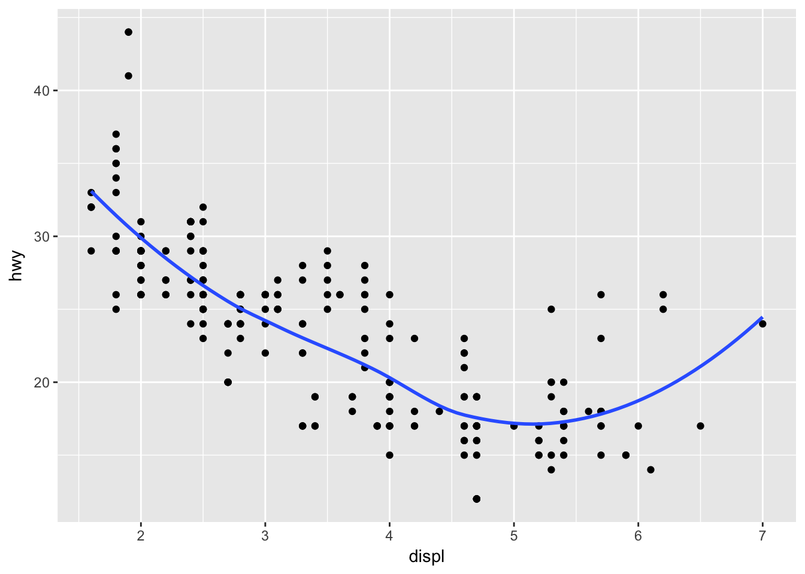


```r
ggplot(data = mpg, mapping = aes(x = displ, y = hwy, grp = drv)) + 
  geom_point() + 
  geom_smooth(se = FALSE)
```

```
## `geom_smooth()` using method = 'loess'
```


```r
ggplot(data = mpg, mapping = aes(x = displ, y = hwy, color = drv)) + 
  geom_point() + 
  geom_smooth(se = FALSE)
```

```
## `geom_smooth()` using method = 'loess'
```


```r
ggplot(data = mpg, mapping = aes(x = displ, y = hwy)) + 
  geom_point(aes(color = drv)) + 
  geom_smooth(se = FALSE)
```

```
## `geom_smooth()` using method = 'loess'
```

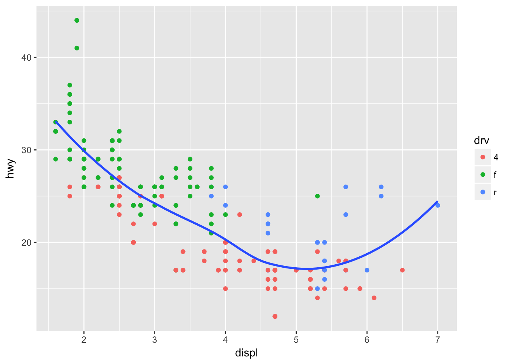


```r
ggplot(data = mpg, mapping = aes(x = displ, y = hwy)) + 
  geom_point(aes(color = drv)) + 
  geom_smooth(aes(linetype = drv), se = FALSE)
```

```
## `geom_smooth()` using method = 'loess'
```


```r
ggplot(data = mpg, mapping = aes(x = displ, y = hwy, color = drv)) + 
  geom_point()
```


## 3.7 - Statistical Transformations {-}

### Problem 1 {-}

What is the default geom associated with `stat_summary()`? How could you rewrite
the previous plot to use that geom function instead of the stat function?

The default geom associated with `stat_summary()` is `pointrange`. We can 
recreate the last plot using:


```r
ggplot(data = diamonds) + 
  geom_pointrange(
    mapping = aes(x = cut, y = depth),
    stat = 'summary',
    fun.ymin = min,
    fun.ymax = max,
    fun.y = median
  )
```

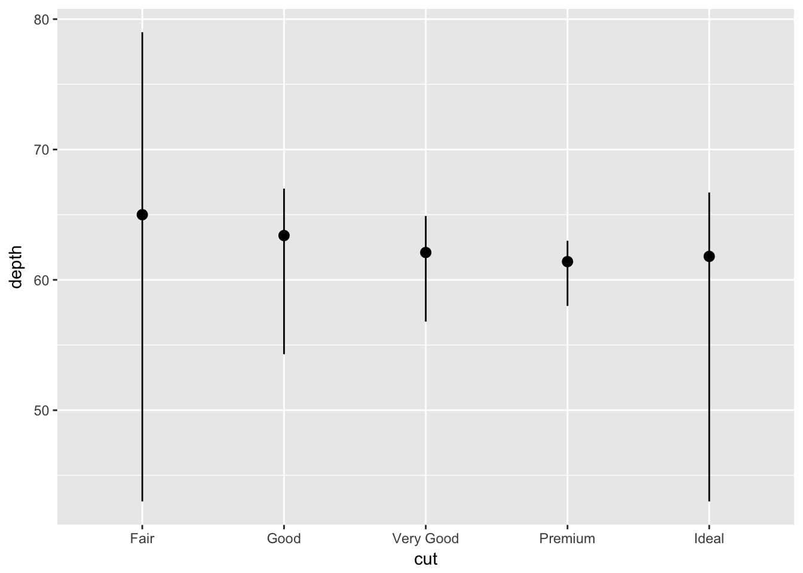

### Problem 2 {-}

What does `geom_col()` do? How is it different to `geom_bar()`?

From the `ggplot2` documentation: `geom_bar()` makes the height of the bar 
proportional to the number of cases in each group, while `geom_col()` will map
directly to the data.

We can make a simple bar chart using `geom_bar` which will transform the data 
under the hood:


```r
ggplot(mpg, aes(class)) + 
  geom_bar()
```


Or do the transformation ourselves and map directly using `geom_col`:


```r
mpg %>%
  group_by(class) %>%
  count() %>%
  ggplot(aes(class, n)) +
  geom_col()
```


### Problem 3 {-}

Most geoms and stats come in pairs that are almost always used in concert. 
Read through the documentation and make a list of all the pairs. 
What do they have in common?

Some examples from the `ggplot2` documentation includes:

* `geom_bar` --> `stat_count`
* `geom_bin2d` --> `stat_bin_2d`
* `geom_boxplot` --> `stat_boxplot`
* `geom_contour` --> `stat_contour`
* `geom_count` --> `stat_sum`
* `geom_density` --> `stat_density`
* `geom_density_2d` --> `stat_density_2d`
* `geom_histogram` --> `stat_bin`
* `geom_hex` --> `stat_bin_hex`

### Problem 4 {-}

What variables does `stat_smooth()` compute? What parameters control its behavior?

`stat_smooth` computes the following:
  * y the predicted value
  * ymin - lower pointwise confidence interval around the mean
  * ymax - upper pointwise confidence interval around the mean
  * se - standard error
  
The behaviour of `stat_smooth` can be controled using:
  * `method` to adjust the smoothing method used
  * `formula` to adjust the smoothing formula used
  * `span` to adjust the amount of smoothing
  * `level` to set the confidence level used
  
### Problem 5 {-}

In our proportion bar chart, we need to set group = 1. Why? In other words 
what is the problem with these two graphs?

The first chart displays a proportion = 1 for all groups.

```r
ggplot(data = diamonds) + 
  geom_bar(mapping = aes(x = cut, y = ..prop..))
```

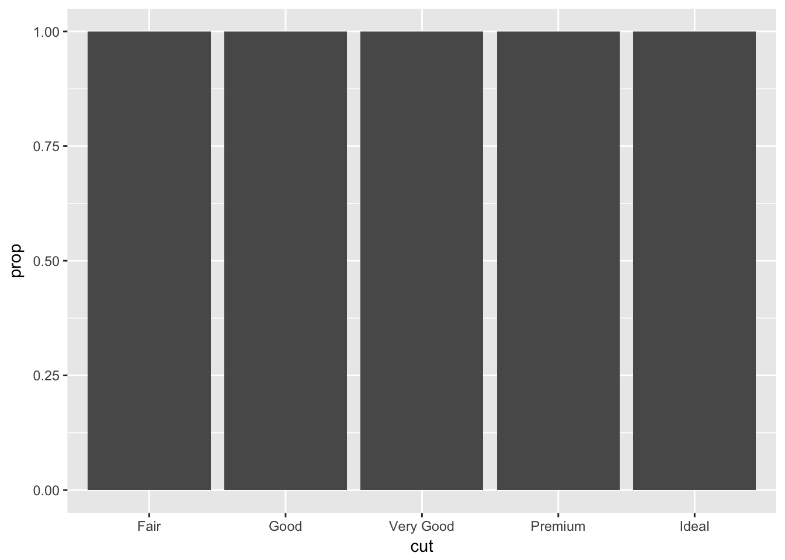

While the second plot does something similar, multiplied by the number of 
categories in `color`.


```r
ggplot(data = diamonds) + 
  geom_bar(mapping = aes(x = cut, fill = color, y = ..prop..))
```

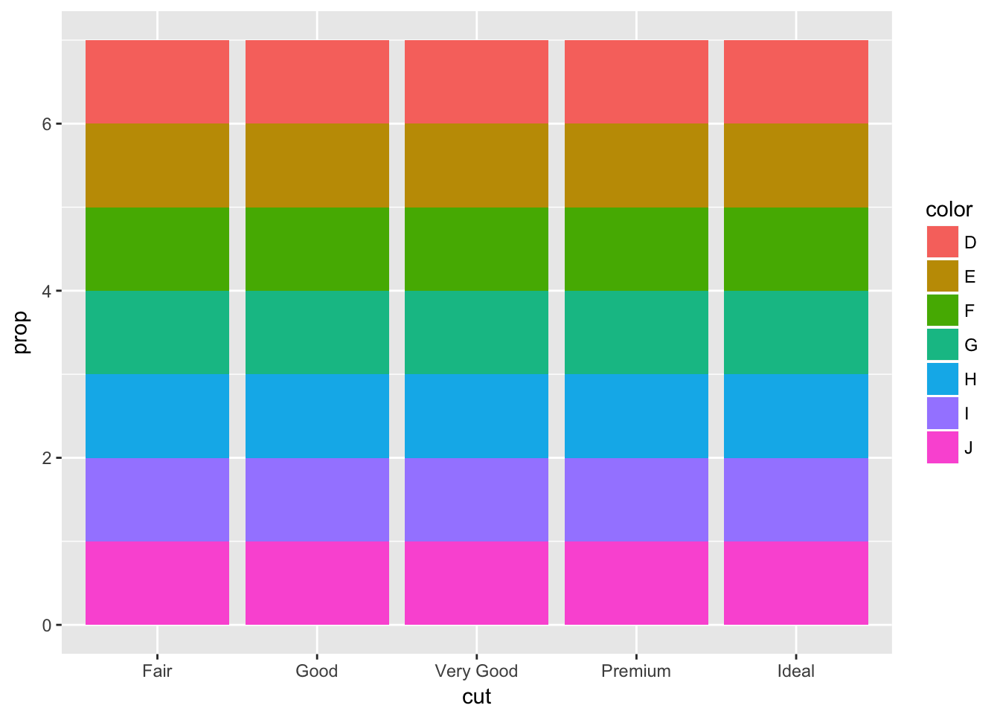

`geom_bar()` will compute `prop` - the groupwise proportion. So we must pass in 
an argument to `group` for `prop` to be calculated properly.


```r
ggplot(data = diamonds) + 
  geom_bar(mapping = aes(x = cut, y = ..prop.., group = 1))
```


```r
ggplot(data = diamonds) + 
  geom_bar(mapping = aes(x = cut, y = ..prop.., fill = color, group = color))
```


## 3.8 - Position Adjustments {-}

### Problem 1 {-}

What is the problem with this plot? How could you improve it?


```r
ggplot(data = mpg, mapping = aes(x = cty, y = hwy)) + 
  geom_point()
```


Use `geom_jitter()` to correct the overplotting in the original.


```r
ggplot(data = mpg, mapping = aes(x = cty, y = hwy)) + 
  geom_jitter()
```


### Problem 2 {-}

What parameters to geom_jitter() control the amount of jittering?

The `width` and `height` arguments control the amount of jittering and defaults 
to 40% of the resolution of the data.

So values less than 0.4 will make a graph more compact than the default `geom_jitter()`


```r
ggplot(data = mpg, mapping = aes(x = cty, y = hwy)) + 
  geom_jitter(width = 0.20, height = 0.20)
```


While values greater than 0.4 will make a smoother graph.


```r
ggplot(data = mpg, mapping = aes(x = cty, y = hwy)) + 
  geom_jitter(width = 0.60, height = 0.60)
```

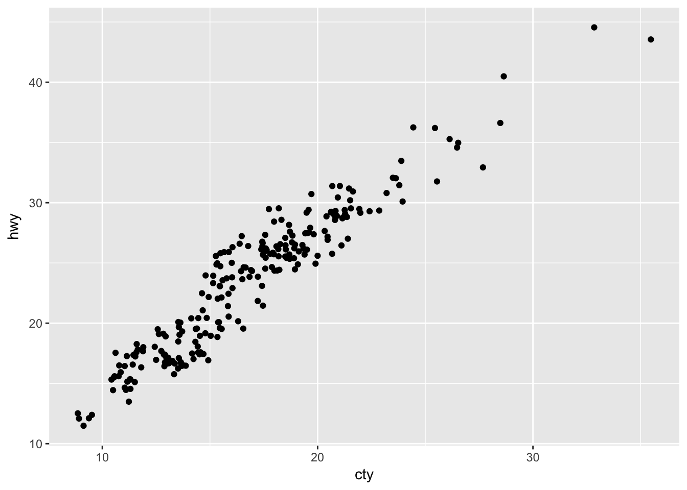

### Problem 3 {-}

Compare and contrast geom_jitter() with geom_count().

`geom_jitter()` and `geom_count` are both useful when dealing with overplotting. 
While `geom_jitter` will add a small amount of noise to each point to spread them 
out, `geom_count` will cont the number of observations at each (x,y) point, and 
then map the count.

`geom_jitter()` is equivalent to `geom_point(position = 'jitter')`
`geom_count()` is equivalent to `geom_point(stat = 'sum')`


```r
ggplot(data = mpg, mapping = aes(x = cty, y = hwy)) + 
  geom_count() 
```

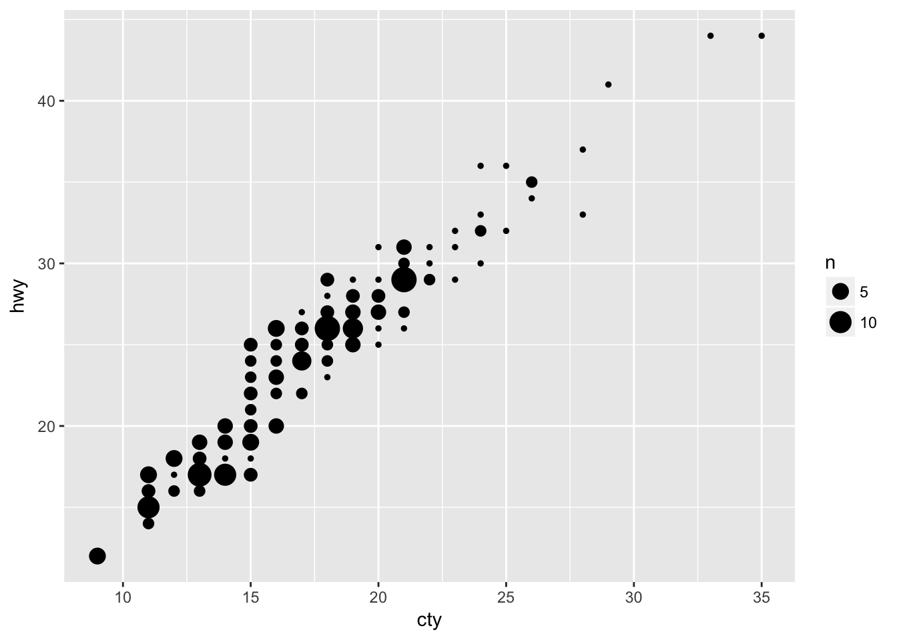

### Problem 4 {-}

What’s the default position adjustment for `geom_boxplot()`? Create a 
visualisation of the mpg dataset that demonstrates it.

The default position adjustment for `geom_boxplot()` is `dodge`.


```r
ggplot(mpg, aes(class, cty, color = drv)) +
  geom_boxplot()
```

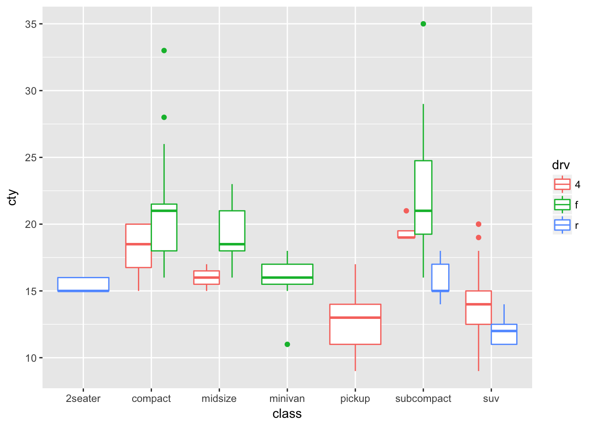


```r
ggplot(mpg, aes(x = class, y = cty, color = drv)) +
  geom_boxplot(position = 'identity')
```


## 3.9 - Coordinate Systems {-}

### Problem 1 {-}

Turn a stacked bar chart into a pie chart using `coord_polar()`.

From the documentation for `coord_polar()` we can first make a stacked bar chart:


```r
ggplot(mtcars, aes(x = factor(1), fill = factor(cyl))) +
 geom_bar()
```


And turn it into a pie chart:


```r
ggplot(mtcars, aes(x = factor(1), fill = factor(cyl))) +
  geom_bar(width = 1) +
  coord_polar(theta = 'y')
```

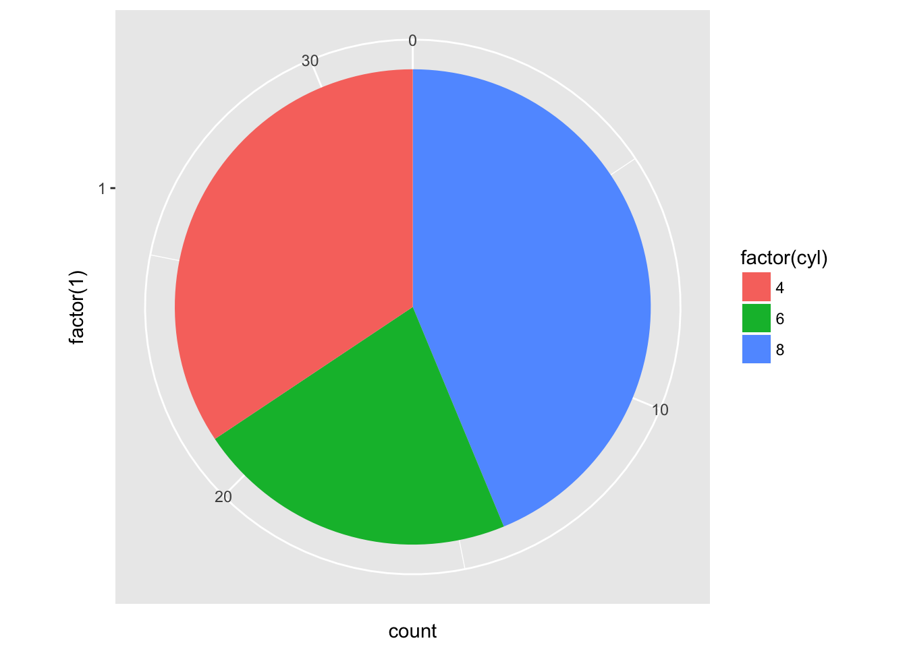

### Problem 2 {-}

What does `labs()` do? Read the documentation.

`labs()` allows you to modify the labels of a plot, axis, or legend.


```r
ggplot(mpg, aes(cty, hwy)) +
  geom_point() +
  labs(title = 'Title',
       subtitle = 'Subtitle',
       caption = 'Caption')
```


### Problem 3 {-}

What’s the difference between `coord_quickmap()` and `coord_map()`?

`coord_quickmap` preserves straight lines when projecting onto a two dimensional 
surface and requires less computation.


```r
library(maps)
```

```
## 
## Attaching package: 'maps'
```

```
## The following object is masked from 'package:purrr':
## 
##     map
```

```r
ggplot(map_data('state'), aes(long, lat, group = group)) +
  geom_polygon(fill = 'white', color = 'black') +
  coord_map()
```


```r
ggplot(map_data('state'), aes(long, lat, group = group)) +
  geom_polygon(fill = 'white', color = 'black') +
  coord_quickmap()
```


### Problem 4 {-}

What does the plot below tell you about the relationship between city and 
highway mpg? Why is `coord_fixed()` important? What does `geom_abline()` do?

`coord_fixed()` (with no arguments) ensures that a unit on the x-axis is the 
same length as a unit on the y-axis. 

`geom_abline()` (with no arguments) adds a reference line with an intercept of 
0 and a slope of 1. We can quickly see that every observation in the `mpg` 
dataset has better highway than city fuel efficiency.


```r
ggplot(data = mpg, mapping = aes(x = cty, y = hwy)) +
  geom_point() + 
  geom_abline() +
  coord_fixed()
```

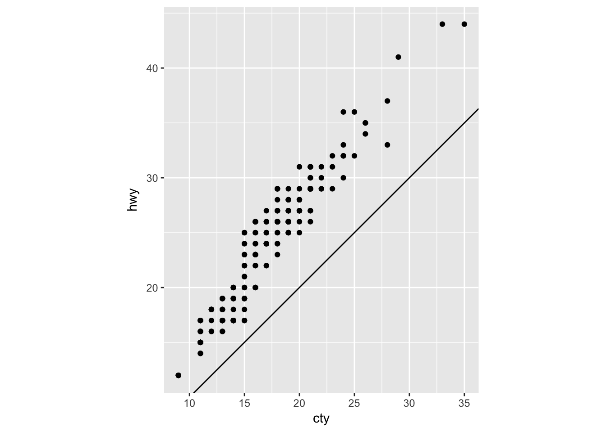


