# Chapter 3 - Data Visualisation {-}

Load the libraries needed for these exercises.


```r
library(tidyverse)
library(maps)
```

## 3.2 - First Steps {-}

### Problem 1 {-}

Run `ggplot(data = mpg)`. What do you see?

The initial `ggplot()` call creates a a blank plot without any aesthetics.


```r
ggplot(data = mpg)
```


### Problem 2 {-}

How many rows are in `mpg`? How many columns?

Use the `nrow()` and `ncol()` functions from `base` to determine that there are 
234 rows and 11 columns in the `mpg` data set.


```r
nrow(mpg)
```

```
## [1] 234
```

```r
ncol(mpg)
```

```
## [1] 11
```

### Problem 3 {-}

What does the `drv` variable describe? Read the help for `?mpg` to find out.

The variable `drv` describes the drive of the vehicle: f = front-wheel drive, 
r = rear wheel drive, 4 = 4wd.

### Problem 4 {-}

Make a scatter plot of `hwy` vs `cyl`.

Set `hwy` and `cyl` as the `x` and `y` variables within `aes()`, and use 
`geom_point()` to create a scatterplot.


```r
ggplot(data = mpg, mapping = aes(x = cyl, y = hwy)) +
  geom_point()
```

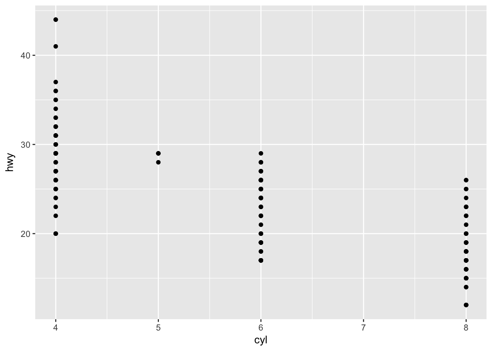

### Problem 5 {-}

What happens if you make a scatter plot of `class` vs `drv`? Why is the plot 
not useful?

Since `class` and `drv` are categorical variables, there isn't much of a 
meaningful relationship in the scatter plot.


```r
ggplot(data = mpg, mapping = aes(x = class, y = drv)) +
  geom_point()
```

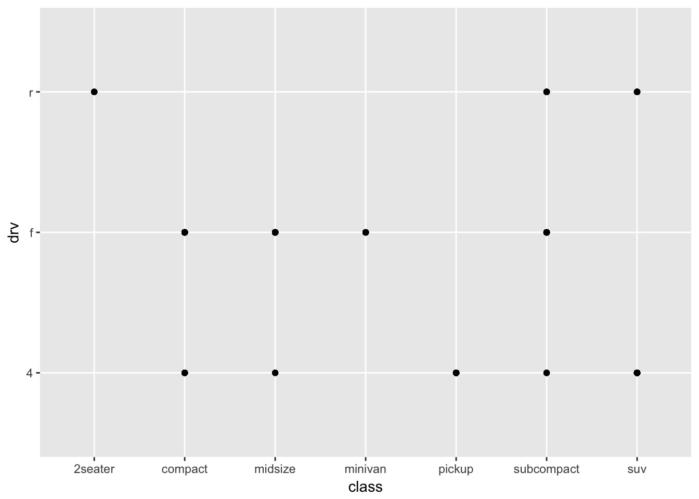


## 3.3 - Aesthetic Mappings {-}

### Problem 1 {-}

What’s gone wrong with this code? Why are the points not blue?


```r
ggplot(data = mpg) + 
  geom_point(mapping = aes(x = displ, y = hwy, color = "blue"))
```

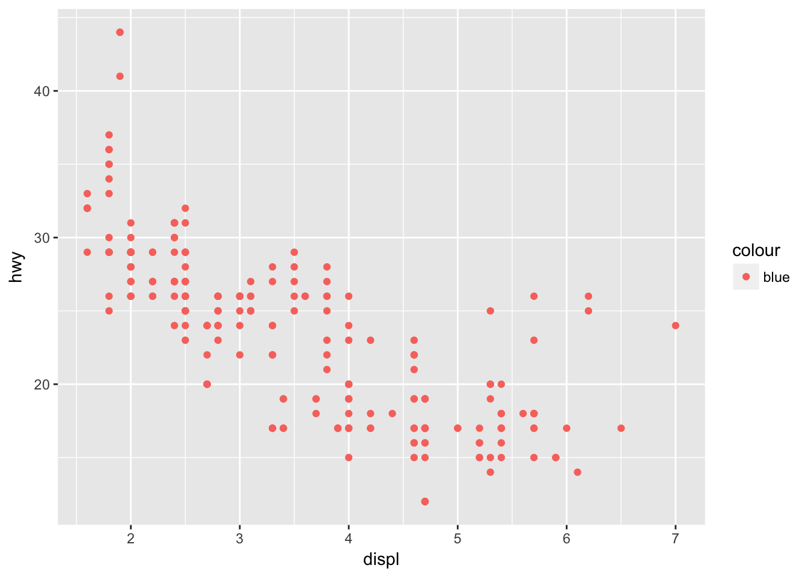

To set an aesthetic manually, it must go outside of `aes()`.


```r
ggplot(data = mpg) + 
  geom_point(mapping = aes(x = displ, y = hwy), color = "blue")
```


### Problem 2 {-}

Which variables in `mpg` are categorical? Which variables are continuous? 
(Hint: type `?mpg` to read the documentation for the data set). How can you see 
this information when you run mpg?

Use `str()` to see the structure of a dataset.


```r
str(mpg)
```

```
## Classes 'tbl_df', 'tbl' and 'data.frame':	234 obs. of  11 variables:
##  $ manufacturer: chr  "audi" "audi" "audi" "audi" ...
##  $ model       : chr  "a4" "a4" "a4" "a4" ...
##  $ displ       : num  1.8 1.8 2 2 2.8 2.8 3.1 1.8 1.8 2 ...
##  $ year        : int  1999 1999 2008 2008 1999 1999 2008 1999 1999 2008 ...
##  $ cyl         : int  4 4 4 4 6 6 6 4 4 4 ...
##  $ trans       : chr  "auto(l5)" "manual(m5)" "manual(m6)" "auto(av)" ...
##  $ drv         : chr  "f" "f" "f" "f" ...
##  $ cty         : int  18 21 20 21 16 18 18 18 16 20 ...
##  $ hwy         : int  29 29 31 30 26 26 27 26 25 28 ...
##  $ fl          : chr  "p" "p" "p" "p" ...
##  $ class       : chr  "compact" "compact" "compact" "compact" ...
```

### Problem 3 {-}

Map a continuous variable to color, size, and shape. How do these aesthetics 
behave differently for categorical vs. continuous variables?

Continuous variables will use a gradient to scale `color` and `size`, but will 
throw an error when applied to shape.


```r
ggplot(data = mpg, mapping = aes(x = cty, y = hwy, color = displ)) + 
  geom_point()
```


```r
ggplot(data = mpg, mapping = aes(x = cty, y = hwy, size = displ)) + 
  geom_point()
```


```r
p <- ggplot(data = mpg, mapping = aes(x = cty, y = hwy, shape = displ)) + 
  geom_point()
```

### Problem 4 {-}

What happens if you map the same variable to multiple aesthetics?

Mapping `displ` to `color` and `size` results in the following graph. Not 
necessarily helpful, but two ways of displaying the some variation.


```r
ggplot(data = mpg, mapping = aes(x = cty, y = hwy, color = displ, size = displ)) + 
  geom_point()
```


### Problem 5 {-}

What does the stroke aesthetic do? What shapes does it work with? 
(Hint: use ?geom_point)

The `stroke` aesthetic will modify the width of the border of a shape. Taking 
the example from the `ggplot2` documentation:


```r
ggplot(data = mtcars, mapping = aes(x = wt, y = mpg)) +
  geom_point(shape = 21, colour = "black", fill = "white", size = 5, stroke = 5)
```


### Problem 6 {-}

What happens if you map an aesthetic to something other than a variable name, 
like `aes(colour = displ < 5)`?

In this case the condition passed to `color` returns a boolean that will map 
to `color`.


```r
ggplot(data = mtcars, mapping = aes(wt, mpg, color = disp < 100)) +
  geom_point()
```

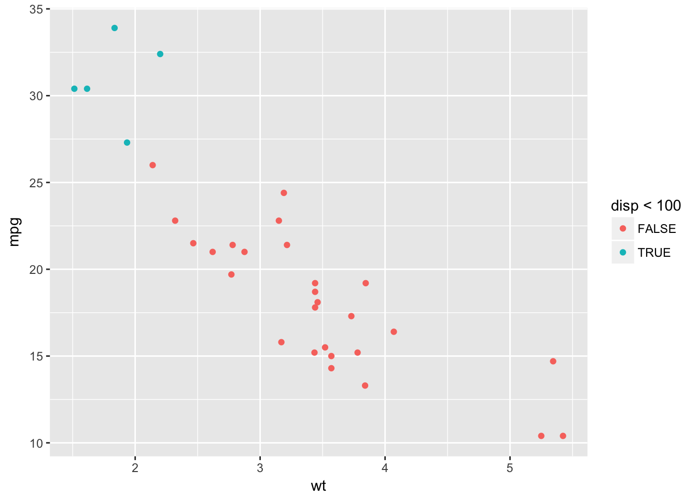

## 3.5 - Facets {-}

### Problem 1 {-}

What happens if you facet on a continuous variable?

The `facet_wrap` feature will still produce plots for each unique value, but 
the result is not necessarily helpful.


```r
ggplot(data = mtcars, mapping = aes(disp, mpg)) +
  geom_point() +
  facet_wrap(~ wt)
```

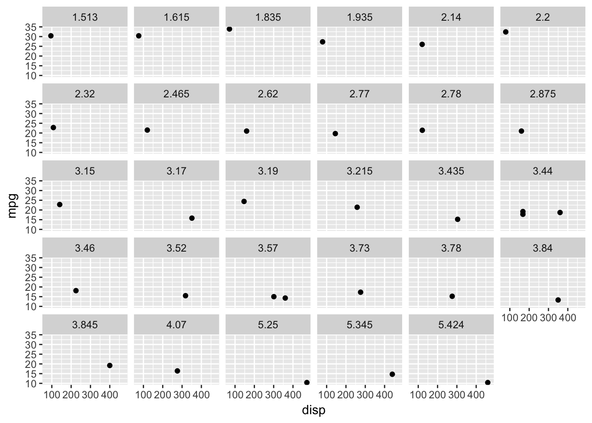

### Problem 2 {-}

What do the empty cells in plot with `facet_grid(drv ~ cyl)` mean? How do they 
relate to this plot?

Empty cells occur when there are no observations within a specific combination 
of facet variables. For instance, in the given plot there are no vehicles with 
4wd and 5 cylinders, which matches the empty cell with `facet_grid(drv ~ cyl)`.


```r
ggplot(data = mpg) + 
  geom_point(mapping = aes(x = drv, y = cyl))
```


### Problem 3 {-}

What plots does the following code make? What does `.` do?

In the first example, using `.` creates a `facet_grid()` plot without a 
column variable.


```r
ggplot(data = mpg) + 
  geom_point(mapping = aes(x = displ, y = hwy)) +
  facet_grid(drv ~ .)
```


This can be easier than trying to hack together a similar plot using 
`facet_wrap()`.


```r
ggplot(data = mpg) + 
  geom_point(mapping = aes(x = displ, y = hwy)) +
  facet_wrap(~ drv, nrow = n_distinct(mpg$drv))
```


The `.` can also be used to make a `facet_grid()` while omitting a row variable.


```r
ggplot(data = mpg) + 
  geom_point(mapping = aes(x = displ, y = hwy)) +
  facet_grid(. ~ cyl)
```


### Problem 4 {-}

Take the first faceted plot in this section. What are the advantages to using 
faceting instead of the colour aesthetic? What are the disadvantages? How might 
the balance change if you had a larger dataset?

Faceting can make it easier to see the variation by `class` than using the color 
aesthetic, but can be unwieldy when the number of distinct values in `class` is 
large. For a larger dataset, faceting may be necessary, as the increased number 
of points may make it difficult to see a variation by color.

Compare the following plots:


```r
ggplot(data = mpg) + 
  geom_point(mapping = aes(x = displ, y = hwy)) + 
  facet_wrap(~ class, nrow = 2)
```

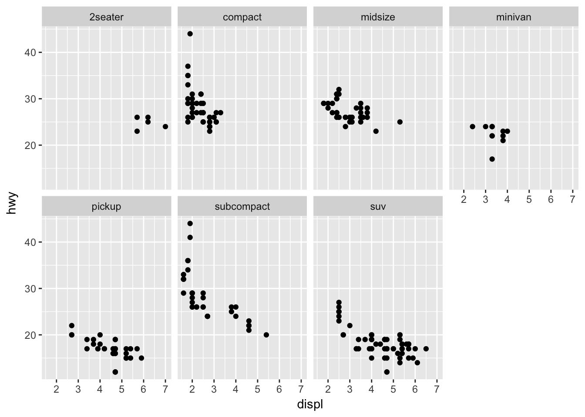


```r
ggplot(data = mpg) + 
  geom_point(mapping = aes(x = displ, y = hwy, color = class))
```


### Problem 5 {-}

Read `?facet_wrap`. What does `nrow` do? What does `ncol` do? What other options 
control the layout of the individual panels? Why doesn’t `facet_grid()` have 
`nrow` and `ncol` arguments?

The `nrow` and `ncol` arguments allow you to control the number of rows or 
columns in the panel. There are a number of other arguments in `facet_wrap()`:
  * `scales`: can fix scales or allow them to vary
  * `shrink`: shrink scales to fit output of statistics, not raw data
  * `labeller`: takes one data frame of labels and returns a list or data frame 
  of character vectors
  * `as.table`: display facets as a table or a plot
  * `switch`: flip the labels
  * `drop`: drop unused factor lebels
  * `dir`: control direction of the panel
  * `strip.position`: control where to place the labels

The `facet_grid()` function has `nrow` and `ncol` predefined by the faceting 
variables.

### Problem 6 {-}

When using facet_grid() you should usually put the variable with more unique 
levels in the columns. Why?

This will expand the panel vertically, making it easier to scroll through 
the grid. Compare the following two plots:


```r
ggplot(data = mpg) + 
  geom_point(mapping = aes(x = displ, y = hwy)) +
  facet_grid(trans ~ drv)
```


```r
ggplot(data = mpg) + 
  geom_point(mapping = aes(x = displ, y = hwy)) +
  facet_grid(drv ~ trans)
```


## 3.6 - Geometric Objects {-}

### Problem 1 {-}

What geom would you use to draw a line chart? A boxplot? A histogram? An area 
chart?

Use `geom_line()` to draw a line chart.


```r
ggplot(data = economics, mapping = aes(x = date, y = unemploy)) + 
  geom_line()
```


Use `geom_boxplot()` to create a boxplot.


```r
ggplot(data = mpg, mapping = aes(x = class, y = hwy)) +
  geom_boxplot()
```


Use `geom_histogram()` to create a histogram.


```r
ggplot(data = mpg, mapping = aes(x = hwy)) +
  geom_histogram()
```

```
## `stat_bin()` using `bins = 30`. Pick better value with `binwidth`.
```


And use `geom_area()` to create an area chart.


```r
ggplot(data = economics, mapping = aes(x = date, y = unemploy)) + 
  geom_area()
```


### Problem 2 {-}

Run this code in your head and predict what the output will look like. Then, 
run the code in R and check your predictions.

Be sure to think through the initial `ggplot` call and consider what will be 
passed to `geom_point()` and `geom_smooth()`.


```r
ggplot(data = mpg, mapping = aes(x = displ, y = hwy, color = drv)) + 
  geom_point() + 
  geom_smooth(se = FALSE)
```

```
## `geom_smooth()` using method = 'loess'
```


### Problem 3 {-}

What does `show.legend = FALSE` do? What happens if you remove it? Why do you 
think I used it earlier in the chapter?

The `show.legend` argument can be used to map a layer to a legend. Setting 
to `FALSE` will remove that layer from the plot. 


```r
ggplot(data = mpg, mapping = aes(x = displ, y = hwy, color = drv)) + 
  geom_point(show.legend = FALSE) +
  geom_smooth(se = FALSE, show.legend = FALSE)
```

```
## `geom_smooth()` using method = 'loess'
```

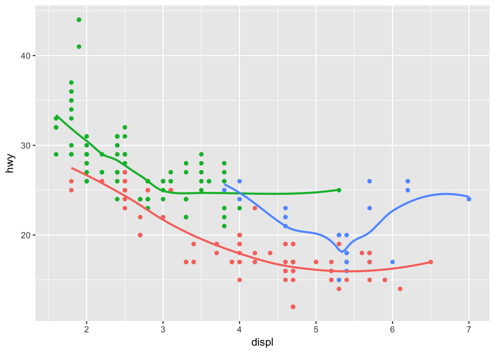

But note that this only works by geom:


```r
ggplot(data = mpg, mapping = aes(x = displ, y = hwy, color = drv)) + 
  geom_point(show.legend = FALSE) + 
  geom_smooth(se = FALSE)
```

```
## `geom_smooth()` using method = 'loess'
```


### Problem 4 {-}

What does the `se` argument to `geom_smooth()` do?

The `se` argument controls whether a confidence band is displayed around 
the smoothed line. Note that the argument is set to `TRUE` by default.


```r
ggplot(data = mpg, mapping = aes(x = displ, y = hwy, color = drv)) + 
  geom_point(show.legend = FALSE) + 
  geom_smooth()
```

```
## `geom_smooth()` using method = 'loess'
```


The `level` argument is used to control the confidence interval, and is set to 
0.95 by default.


```r
ggplot(data = mpg, mapping = aes(x = displ, y = hwy, color = drv)) + 
  geom_point(show.legend = FALSE) + 
  geom_smooth(level = 0.9999)
```

```
## `geom_smooth()` using method = 'loess'
```


### Problem 5 {-}

Will these two graphs look different? Why/why not?

The graphs should look the same, as `data` and `aes` are inherited by
`geom_point()` and `geom_smooth()` in the first example.


```r
ggplot(data = mpg, mapping = aes(x = displ, y = hwy)) + 
  geom_point() + 
  geom_smooth()
```

```
## `geom_smooth()` using method = 'loess'
```


```r
ggplot() + 
  geom_point(data = mpg, mapping = aes(x = displ, y = hwy)) + 
  geom_smooth(data = mpg, mapping = aes(x = displ, y = hwy))
```

```
## `geom_smooth()` using method = 'loess'
```


### Problem 6 {-}

Recreate the R code necessary to generate the following graphs.

Be sure to think through how each `aes` is set and inherited.


```r
ggplot(data = mpg, mapping = aes(x = displ, y = hwy)) + 
  geom_point() + 
  geom_smooth(se = FALSE)
```

```
## `geom_smooth()` using method = 'loess'
```


```r
ggplot(data = mpg, mapping = aes(x = displ, y = hwy, grp = drv)) + 
  geom_point() + 
  geom_smooth(se = FALSE)
```

```
## `geom_smooth()` using method = 'loess'
```

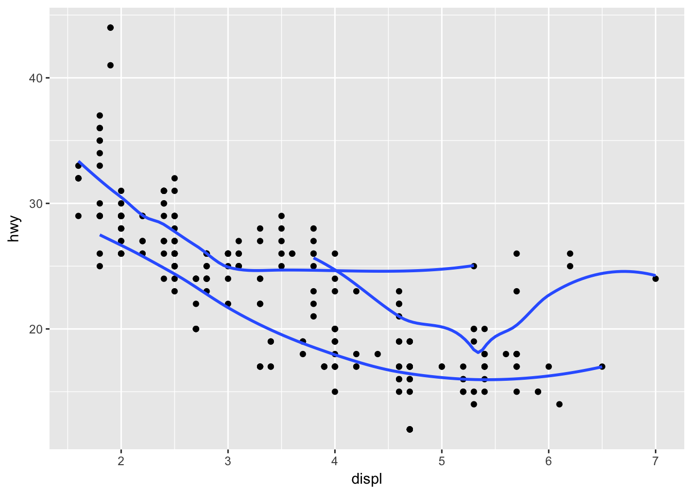


```r
ggplot(data = mpg, mapping = aes(x = displ, y = hwy, color = drv)) + 
  geom_point() + 
  geom_smooth(se = FALSE)
```

```
## `geom_smooth()` using method = 'loess'
```


```r
ggplot(data = mpg, mapping = aes(x = displ, y = hwy)) + 
  geom_point(aes(color = drv)) + 
  geom_smooth(se = FALSE)
```

```
## `geom_smooth()` using method = 'loess'
```


```r
ggplot(data = mpg, mapping = aes(x = displ, y = hwy)) + 
  geom_point(aes(color = drv)) + 
  geom_smooth(aes(linetype = drv), se = FALSE)
```

```
## `geom_smooth()` using method = 'loess'
```


```r
ggplot(data = mpg, mapping = aes(x = displ, y = hwy, color = drv)) + 
  geom_point()
```


## 3.7 - Statistical Transformations {-}

### Problem 1 {-}

What is the default geom associated with `stat_summary()`? How could you rewrite
the previous plot to use that geom function instead of the stat function?

The default geom associated with `stat_summary()` is `pointrange`. Recreate the 
last plot using:


```r
ggplot(data = diamonds) + 
  geom_pointrange(
    mapping = aes(x = cut, y = depth),
    stat = 'summary',
    fun.ymin = min,
    fun.ymax = max,
    fun.y = median
  )
```


### Problem 2 {-}

What does `geom_col()` do? How is it different to `geom_bar()`?

From the `ggplot2` documentation: `geom_bar()` makes the height of the bar 
proportional to the number of cases in each group, while `geom_col()` will map
directly to the data.

Make a simple bar chart using `geom_bar` which will transform the data 
under the hood:


```r
ggplot(mpg, aes(class)) + 
  geom_bar()
```


Or do the transformation manually and map directly using `geom_col`:


```r
mpg %>%
  group_by(class) %>%
  count() %>%
  ggplot(aes(class, n)) +
  geom_col()
```

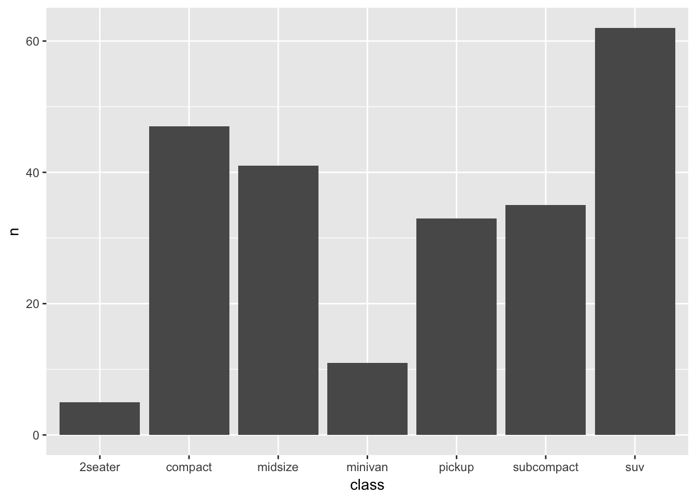

### Problem 3 {-}

Most geoms and stats come in pairs that are almost always used in concert. 
Read through the documentation and make a list of all the pairs. 
What do they have in common?

Some examples from the `ggplot2` documentation include:

* `geom_bar` --> `stat_count`
* `geom_bin2d` --> `stat_bin_2d`
* `geom_boxplot` --> `stat_boxplot`
* `geom_contour` --> `stat_contour`
* `geom_count` --> `stat_sum`
* `geom_density` --> `stat_density`
* `geom_density_2d` --> `stat_density_2d`
* `geom_histogram` --> `stat_bin`
* `geom_hex` --> `stat_bin_hex`

### Problem 4 {-}

What variables does `stat_smooth()` compute? What parameters control its behavior?

`stat_smooth` computes the following:

* `y` - the predicted value
* `ymin` - lower pointwise confidence interval around the mean
* `ymax` - upper pointwise confidence interval around the mean
* `se` - standard error
  
The behaviour of `stat_smooth` can be controled using:

* `method` to adjust the smoothing method used
* `formula` to adjust the smoothing formula used
* `span` to adjust the amount of smoothing
* `level` to set the confidence level used
  
### Problem 5 {-}

In our proportion bar chart, we need to set group = 1. Why? In other words 
what is the problem with these two graphs?

The first chart displays a proportion = 1 for all groups.


```r
ggplot(data = diamonds) + 
  geom_bar(mapping = aes(x = cut, y = ..prop..))
```


While the second plot does something similar, multiplied by the number of 
categories in `color`.


```r
ggplot(data = diamonds) + 
  geom_bar(mapping = aes(x = cut, fill = color, y = ..prop..))
```


`geom_bar()` will compute `prop` - the groupwise proportion. So pass in 
an argument to `group` for `prop` to be calculated properly.


```r
ggplot(data = diamonds) + 
  geom_bar(mapping = aes(x = cut, y = ..prop.., group = 1))
```

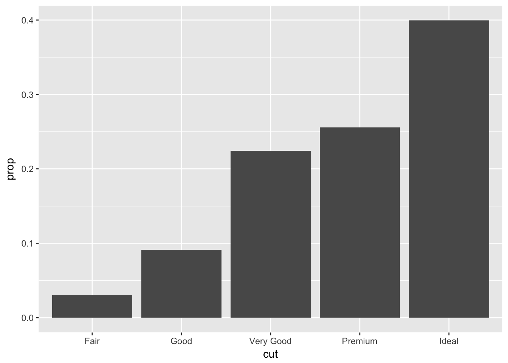


```r
ggplot(data = diamonds) + 
  geom_bar(mapping = aes(x = cut, y = ..prop.., fill = color, group = color))
```

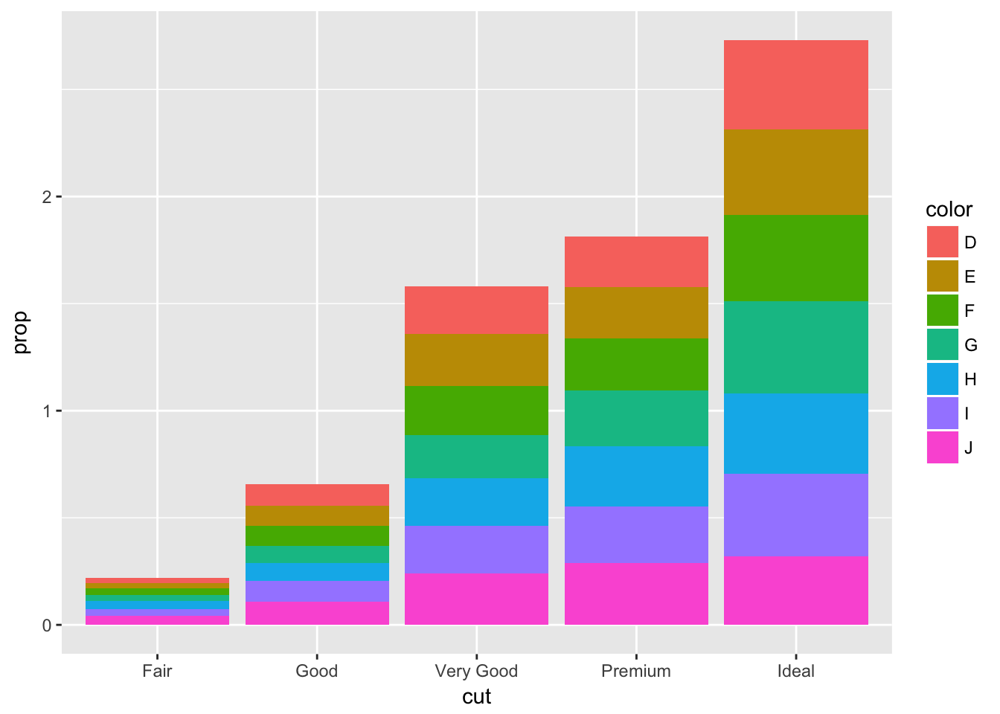

## 3.8 - Position Adjustments {-}

### Problem 1 {-}

What is the problem with this plot? How could you improve it?


```r
ggplot(data = mpg, mapping = aes(x = cty, y = hwy)) + 
  geom_point()
```


Use `geom_jitter()` to correct the overplotting in the original.


```r
ggplot(data = mpg, mapping = aes(x = cty, y = hwy)) + 
  geom_jitter()
```


### Problem 2 {-}

What parameters to `geom_jitter()` control the amount of jittering?

The `width` and `height` arguments control the amount of jittering and defaults 
to 40% of the resolution of the data.

So values less than 0.4 will make a graph more compact than the default 
`geom_jitter()` and values greater than 0.4 will make the graph more spread out.


```r
ggplot(data = mpg, mapping = aes(x = cty, y = hwy)) + 
  geom_jitter(width = 0.20, height = 0.20)
```


While values greater than 0.4 will make a smoother graph.


```r
ggplot(data = mpg, mapping = aes(x = cty, y = hwy)) + 
  geom_jitter(width = 0.60, height = 0.60)
```


### Problem 3 {-}

Compare and contrast `geom_jitter()` with `geom_count()`.

`geom_jitter()` and `geom_count()` are both useful when dealing with 
overplotting. While `geom_jitter` will add a small amount of noise to each 
point to spread them out, `geom_count` will count the number of observations at 
each (x,y) point, and then map the count.

`geom_jitter()` is equivalent to `geom_point(position = 'jitter')`
`geom_count()` is equivalent to `geom_point(stat = 'sum')`


```r
ggplot(data = mpg, mapping = aes(x = cty, y = hwy)) + 
  geom_count() 
```


### Problem 4 {-}

What’s the default position adjustment for `geom_boxplot()`? Create a 
visualisation of the mpg dataset that demonstrates it.

The default position adjustment for `geom_boxplot()` is `dodge`.


```r
ggplot(data = mpg, aes(x = class, y = cty, color = drv)) +
  geom_boxplot()
```


```r
ggplot(data = mpg, aes(x = class, y = cty, color = drv)) +
  geom_boxplot(position = 'identity')
```


## 3.9 - Coordinate Systems {-}

### Problem 1 {-}

Turn a stacked bar chart into a pie chart using `coord_polar()`.

From the documentation for `coord_polar()` - first make a stacked bar chart:


```r
ggplot(data = mtcars, aes(x = factor(1), fill = factor(cyl))) +
 geom_bar()
```


And then turn it into a pie chart:


```r
ggplot(data = mtcars, aes(x = factor(1), fill = factor(cyl))) +
  geom_bar(width = 1) +
  coord_polar(theta = 'y')
```


### Problem 2 {-}

What does `labs()` do? Read the documentation.

`labs()` controls the labels of a plot, axis, or legend.


```r
ggplot(mpg, aes(cty, hwy)) +
  geom_point() +
  labs(title = 'Title',
       subtitle = 'Subtitle',
       caption = 'Caption')
```


### Problem 3 {-}

What’s the difference between `coord_quickmap()` and `coord_map()`?

`coord_quickmap()` preserves straight lines when projecting onto a two 
dimensional surface and requires less computation.


```r
ggplot(map_data('state'), aes(long, lat, group = group)) +
  geom_polygon(fill = 'white', color = 'black') +
  coord_map()
```

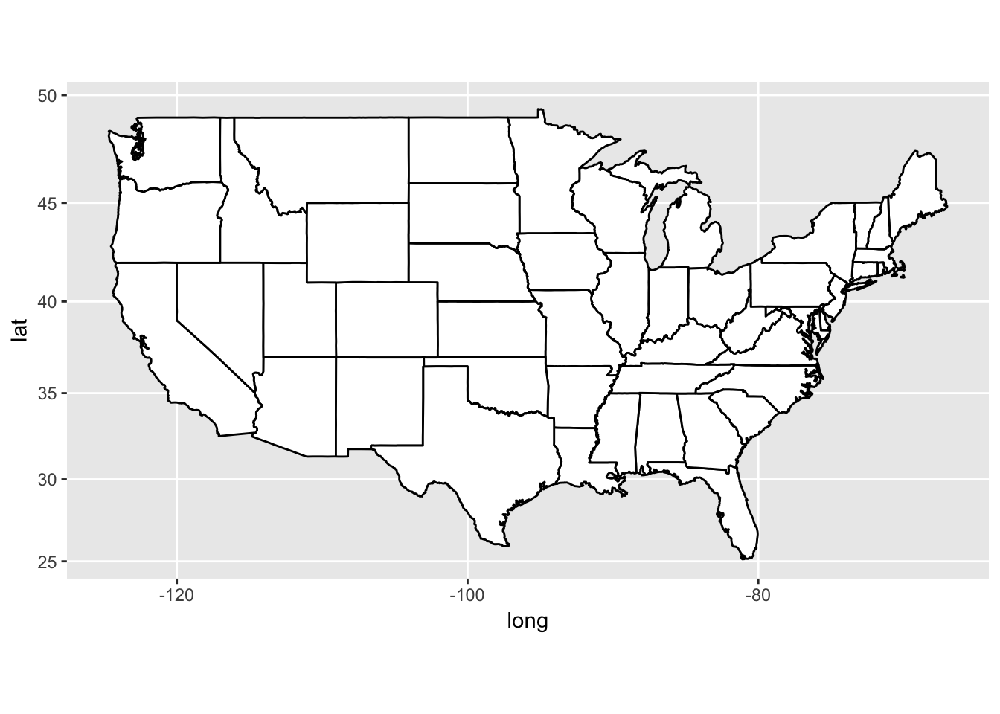


```r
ggplot(map_data('state'), aes(long, lat, group = group)) +
  geom_polygon(fill = 'white', color = 'black') +
  coord_quickmap()
```


### Problem 4 {-}

What does the plot below tell you about the relationship between city and 
highway mpg? Why is `coord_fixed()` important? What does `geom_abline()` do?

`coord_fixed()` (with no arguments) ensures that a unit on the x-axis is the 
same length as a unit on the y-axis. 

`geom_abline()` (with no arguments) adds a reference line with an intercept of 
0 and a slope of 1. One can quickly see that every observation in the `mpg` 
dataset has better highway than city fuel efficiency.


```r
ggplot(data = mpg, mapping = aes(x = cty, y = hwy)) +
  geom_point() + 
  geom_abline() +
  coord_fixed()
```


