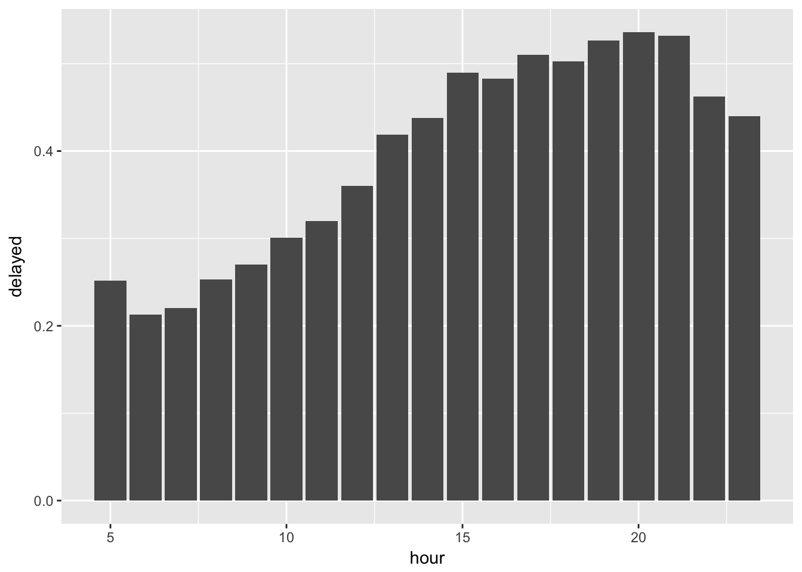

# Chapter 5 - Data Transformation {-}

Load the libraries needed for these exercises.


```r
library(tidyverse)
library(nycflights13)
```


## 5.2 - Filter Rows with filter() {-}

### Problem 1 {-}

Find all flights that:

* Had an arrival delay of two or more hours


```r
flights %>%
  filter(arr_delay >= 120) %>%
  count()
```

```
## # A tibble: 1 x 1
##       n
##   <int>
## 1 10200
```

* Flew to Houston (IAH or HOU)


```r
flights %>%
  filter(dest %in% c('IAH', 'HOU')) %>%
  count()
```

```
## # A tibble: 1 x 1
##       n
##   <int>
## 1  9313
```

* Were operated by United, American, or Delta


```r
flights %>%
  filter(carrier %in% c('UA', 'AA', 'DL')) %>%
  count()
```

```
## # A tibble: 1 x 1
##        n
##    <int>
## 1 139504
```

* Departed in summer (July, August, and September)


```r
flights %>%
  filter(month %in% c(7, 8, 9)) %>%
  count()
```

```
## # A tibble: 1 x 1
##       n
##   <int>
## 1 86326
```

* Arrived more than two hours late, but didn’t leave late


```r
flights %>%
  filter(arr_delay >= 120, dep_delay <= 0) %>%
  count()
```

```
## # A tibble: 1 x 1
##       n
##   <int>
## 1    29
```

* Were delayed by at least an hour, but made up over 30 minutes in flight


```r
flights %>%
  filter(dep_delay >= 60, arr_delay <= dep_delay - 30) %>%
  count()
```

```
## # A tibble: 1 x 1
##       n
##   <int>
## 1  2074
```

* Departed between midnight and 6am (inclusive)


```r
flights %>%
  filter(dep_time >= 0, dep_time <= 600) %>%
  count()
```

```
## # A tibble: 1 x 1
##       n
##   <int>
## 1  9344
```

### Problem 2 {-}

Another useful dplyr filtering helper is `between()`. What does it do? Can you 
use it to simplify the code needed to answer the previous challenges?

`between()` is a shortcut for `x >= left & x <= right`. We can simplify the last 
answer to Problem 1 as:


```r
flights %>%
  filter(between(dep_time, 0, 600)) %>%
  count()
```

```
## # A tibble: 1 x 1
##       n
##   <int>
## 1  9344
```

### Problem 3 {-}

How many flights have a missing dep_time? What other variables are missing? 
What might these rows represent?

We use `is.na()` to filter the flights with a missing departure time.


```r
flights %>%
  filter(is.na(dep_time)) %>%
  count()
```

```
## # A tibble: 1 x 1
##       n
##   <int>
## 1  8255
```

Using `summary()` to see the breakout of the other variables, there appear to 
be flights that were cancelled.


```r
flights %>%
  filter(is.na(dep_time)) %>%
  summary()
```

```
##       year          month             day          dep_time   
##  Min.   :2013   Min.   : 1.000   Min.   : 1.0   Min.   : NA   
##  1st Qu.:2013   1st Qu.: 3.000   1st Qu.: 8.0   1st Qu.: NA   
##  Median :2013   Median : 6.000   Median :12.0   Median : NA   
##  Mean   :2013   Mean   : 5.927   Mean   :14.6   Mean   :NaN   
##  3rd Qu.:2013   3rd Qu.: 8.000   3rd Qu.:23.0   3rd Qu.: NA   
##  Max.   :2013   Max.   :12.000   Max.   :31.0   Max.   : NA   
##                                                 NA's   :8255  
##  sched_dep_time   dep_delay       arr_time    sched_arr_time
##  Min.   : 106   Min.   : NA    Min.   : NA    Min.   :   1  
##  1st Qu.:1159   1st Qu.: NA    1st Qu.: NA    1st Qu.:1330  
##  Median :1559   Median : NA    Median : NA    Median :1749  
##  Mean   :1492   Mean   :NaN    Mean   :NaN    Mean   :1669  
##  3rd Qu.:1855   3rd Qu.: NA    3rd Qu.: NA    3rd Qu.:2049  
##  Max.   :2359   Max.   : NA    Max.   : NA    Max.   :2359  
##                 NA's   :8255   NA's   :8255                 
##    arr_delay      carrier              flight       tailnum         
##  Min.   : NA    Length:8255        Min.   :   1   Length:8255       
##  1st Qu.: NA    Class :character   1st Qu.:1577   Class :character  
##  Median : NA    Mode  :character   Median :3535   Mode  :character  
##  Mean   :NaN                       Mean   :3063                     
##  3rd Qu.: NA                       3rd Qu.:4373                     
##  Max.   : NA                       Max.   :6177                     
##  NA's   :8255                                                       
##     origin              dest              air_time       distance     
##  Length:8255        Length:8255        Min.   : NA    Min.   :  17.0  
##  Class :character   Class :character   1st Qu.: NA    1st Qu.: 292.0  
##  Mode  :character   Mode  :character   Median : NA    Median : 583.0  
##                                        Mean   :NaN    Mean   : 695.4  
##                                        3rd Qu.: NA    3rd Qu.: 872.0  
##                                        Max.   : NA    Max.   :4963.0  
##                                        NA's   :8255                   
##       hour           minute        time_hour                  
##  Min.   : 1.00   Min.   : 0.00   Min.   :2013-01-01 06:00:00  
##  1st Qu.:11.00   1st Qu.: 5.00   1st Qu.:2013-03-07 07:00:00  
##  Median :15.00   Median :27.00   Median :2013-06-12 18:00:00  
##  Mean   :14.67   Mean   :25.61   Mean   :2013-06-13 06:42:11  
##  3rd Qu.:18.00   3rd Qu.:42.00   3rd Qu.:2013-08-22 15:30:00  
##  Max.   :23.00   Max.   :59.00   Max.   :2013-12-31 20:00:00  
## 
```

### Problem 4 {-}

Why is NA ^ 0 not missing? Why is NA | TRUE not missing? 
Why is FALSE & NA not missing? Can you figure out the general rule? 
(NA * 0 is a tricky counterexample!)

Working through these examples:
  * Anything to the zero power is 1
  * Anything OR `TRUE` is `TRUE`
  * Anything AND `FALSE` is `FALSE`

These results apply no matter what the LHS side, and so will apply to NA as well.


```r
NA ^ 0
```

```
## [1] 1
```

```r
NA | TRUE
```

```
## [1] TRUE
```

```r
NA & FALSE
```

```
## [1] FALSE
```

However operations on NA will return NA. NA * 0 is counter intuitive since 
you would think that anything multiplied by 0 would be 0.


```r
NA * 0
```

```
## [1] NA
```

```r
NA ^ 2
```

```
## [1] NA
```

```r
NA + 1
```

```
## [1] NA
```

## 5.3 - Arrange Rows with arrange() {-}

### Problem 1 {-}

How could you use arrange() to sort all missing values to the start? 
(Hint: use is.na()).

We can sort missing values using the format:


```r
flights %>%
  arrange(desc(is.na(dep_time))) %>%
  head()
```

```
## # A tibble: 6 x 19
##    year month   day dep_time sched_dep_time dep_delay arr_time
##   <int> <int> <int>    <int>          <int>     <dbl>    <int>
## 1  2013     1     1       NA           1630        NA       NA
## 2  2013     1     1       NA           1935        NA       NA
## 3  2013     1     1       NA           1500        NA       NA
## 4  2013     1     1       NA            600        NA       NA
## 5  2013     1     2       NA           1540        NA       NA
## 6  2013     1     2       NA           1620        NA       NA
## # ... with 12 more variables: sched_arr_time <int>, arr_delay <dbl>,
## #   carrier <chr>, flight <int>, tailnum <chr>, origin <chr>, dest <chr>,
## #   air_time <dbl>, distance <dbl>, hour <dbl>, minute <dbl>,
## #   time_hour <dttm>
```

### Problem 2 {-}

Sort flights to find the most delayed flights. Find the flights that left 
earliest.

The most delayed flights (by `arr_delay`) are:


```r
flights %>%
  arrange(desc(arr_delay)) %>%
  head()
```

```
## # A tibble: 6 x 19
##    year month   day dep_time sched_dep_time dep_delay arr_time
##   <int> <int> <int>    <int>          <int>     <dbl>    <int>
## 1  2013     1     9      641            900     1301.     1242
## 2  2013     6    15     1432           1935     1137.     1607
## 3  2013     1    10     1121           1635     1126.     1239
## 4  2013     9    20     1139           1845     1014.     1457
## 5  2013     7    22      845           1600     1005.     1044
## 6  2013     4    10     1100           1900      960.     1342
## # ... with 12 more variables: sched_arr_time <int>, arr_delay <dbl>,
## #   carrier <chr>, flight <int>, tailnum <chr>, origin <chr>, dest <chr>,
## #   air_time <dbl>, distance <dbl>, hour <dbl>, minute <dbl>,
## #   time_hour <dttm>
```

The flights that left earliest (by `dep_delay`) are:


```r
flights %>%
  arrange(dep_delay) %>%
  head()
```

```
## # A tibble: 6 x 19
##    year month   day dep_time sched_dep_time dep_delay arr_time
##   <int> <int> <int>    <int>          <int>     <dbl>    <int>
## 1  2013    12     7     2040           2123      -43.       40
## 2  2013     2     3     2022           2055      -33.     2240
## 3  2013    11    10     1408           1440      -32.     1549
## 4  2013     1    11     1900           1930      -30.     2233
## 5  2013     1    29     1703           1730      -27.     1947
## 6  2013     8     9      729            755      -26.     1002
## # ... with 12 more variables: sched_arr_time <int>, arr_delay <dbl>,
## #   carrier <chr>, flight <int>, tailnum <chr>, origin <chr>, dest <chr>,
## #   air_time <dbl>, distance <dbl>, hour <dbl>, minute <dbl>,
## #   time_hour <dttm>
```

### Problem 3 {-}

Sort flights to find the fastest flights.

We first calculate average speed in MPH as distance / hours in the air, and sort 
on the calculated variable.


```r
flights %>%
  mutate(speed = distance / (air_time / 60)) %>%
  arrange(desc(speed)) %>%
  select(speed) %>%
  head()
```

```
## # A tibble: 6 x 1
##   speed
##   <dbl>
## 1  703.
## 2  650.
## 3  648.
## 4  641.
## 5  591.
## 6  564.
```

### Problem 4 {-}

Which flights traveled the longest? Which traveled the shortest?

The longest flights are:


```r
flights %>%
  arrange(desc(distance)) %>%
  head()
```

```
## # A tibble: 6 x 19
##    year month   day dep_time sched_dep_time dep_delay arr_time
##   <int> <int> <int>    <int>          <int>     <dbl>    <int>
## 1  2013     1     1      857            900       -3.     1516
## 2  2013     1     2      909            900        9.     1525
## 3  2013     1     3      914            900       14.     1504
## 4  2013     1     4      900            900        0.     1516
## 5  2013     1     5      858            900       -2.     1519
## 6  2013     1     6     1019            900       79.     1558
## # ... with 12 more variables: sched_arr_time <int>, arr_delay <dbl>,
## #   carrier <chr>, flight <int>, tailnum <chr>, origin <chr>, dest <chr>,
## #   air_time <dbl>, distance <dbl>, hour <dbl>, minute <dbl>,
## #   time_hour <dttm>
```

The shortest flights are:


```r
flights %>%
  arrange(distance) %>%
  head()
```

```
## # A tibble: 6 x 19
##    year month   day dep_time sched_dep_time dep_delay arr_time
##   <int> <int> <int>    <int>          <int>     <dbl>    <int>
## 1  2013     7    27       NA            106       NA        NA
## 2  2013     1     3     2127           2129       -2.     2222
## 3  2013     1     4     1240           1200       40.     1333
## 4  2013     1     4     1829           1615      134.     1937
## 5  2013     1     4     2128           2129       -1.     2218
## 6  2013     1     5     1155           1200       -5.     1241
## # ... with 12 more variables: sched_arr_time <int>, arr_delay <dbl>,
## #   carrier <chr>, flight <int>, tailnum <chr>, origin <chr>, dest <chr>,
## #   air_time <dbl>, distance <dbl>, hour <dbl>, minute <dbl>,
## #   time_hour <dttm>
```

## 5.4 - Select Columns with select() {-}

### Problem 1 {-}

Brainstorm as many ways as possible to select `dep_time`, `dep_delay`, 
`arr_time`, and `arr_delay` from flights.

We can put all the variables directly into our `select()` statement:


```r
flights %>%
  select(dep_time, dep_delay, arr_time, arr_delay) %>%
  head()
```

```
## # A tibble: 6 x 4
##   dep_time dep_delay arr_time arr_delay
##      <int>     <dbl>    <int>     <dbl>
## 1      517        2.      830       11.
## 2      533        4.      850       20.
## 3      542        2.      923       33.
## 4      544       -1.     1004      -18.
## 5      554       -6.      812      -25.
## 6      554       -4.      740       12.
```

Or this would be a good place to try the `starts_with()` function: 


```r
flights %>%
  select(starts_with("dep"), starts_with("arr"))
```

```
## # A tibble: 336,776 x 4
##    dep_time dep_delay arr_time arr_delay
##       <int>     <dbl>    <int>     <dbl>
##  1      517        2.      830       11.
##  2      533        4.      850       20.
##  3      542        2.      923       33.
##  4      544       -1.     1004      -18.
##  5      554       -6.      812      -25.
##  6      554       -4.      740       12.
##  7      555       -5.      913       19.
##  8      557       -3.      709      -14.
##  9      557       -3.      838       -8.
## 10      558       -2.      753        8.
## # ... with 336,766 more rows
```

Or we can try a regex using `matches()`


```r
flights %>%
  select(matches("^dep"), matches("^arr")) %>%
  head()
```

```
## # A tibble: 6 x 4
##   dep_time dep_delay arr_time arr_delay
##      <int>     <dbl>    <int>     <dbl>
## 1      517        2.      830       11.
## 2      533        4.      850       20.
## 3      542        2.      923       33.
## 4      544       -1.     1004      -18.
## 5      554       -6.      812      -25.
## 6      554       -4.      740       12.
```

### Problem 2 {-}

What happens if you include the name of a variable multiple times in a 
select() call?

Duplicating a variable within `select()` will still just return that variable 
one time:


```r
flights %>%
  select(dep_time, dep_time) %>%
  head()
```

```
## # A tibble: 6 x 1
##   dep_time
##      <int>
## 1      517
## 2      533
## 3      542
## 4      544
## 5      554
## 6      554
```

### Problem 3 {-}

What does the one_of() function do? Why might it be helpful in conjunction 
with this vector?


`one_of()` allows you select variables from within a character vector. We can 
pass `vars` to select everything from the vector:


```r
vars <- c("year", "month", "day", "dep_delay", "arr_delay")

flights %>%
  select(one_of(vars))
```

```
## # A tibble: 336,776 x 5
##     year month   day dep_delay arr_delay
##    <int> <int> <int>     <dbl>     <dbl>
##  1  2013     1     1        2.       11.
##  2  2013     1     1        4.       20.
##  3  2013     1     1        2.       33.
##  4  2013     1     1       -1.      -18.
##  5  2013     1     1       -6.      -25.
##  6  2013     1     1       -4.       12.
##  7  2013     1     1       -5.       19.
##  8  2013     1     1       -3.      -14.
##  9  2013     1     1       -3.       -8.
## 10  2013     1     1       -2.        8.
## # ... with 336,766 more rows
```

### Problem 4 {-}

Does the result of running the following code surprise you? How do the select 
helpers deal with case by default? How can you change that default?


```r
select(flights, contains("TIME")) %>%
  head()
```

```
## # A tibble: 6 x 6
##   dep_time sched_dep_time arr_time sched_arr_time air_time
##      <int>          <int>    <int>          <int>    <dbl>
## 1      517            515      830            819     227.
## 2      533            529      850            830     227.
## 3      542            540      923            850     160.
## 4      544            545     1004           1022     183.
## 5      554            600      812            837     116.
## 6      554            558      740            728     150.
## # ... with 1 more variable: time_hour <dttm>
```

`contains()` contains an argument `ignore.case` which defaults to `TRUE`, we can 
set this to `FALSE` if needed:


```r
select(flights, contains("TIME", ignore.case = FALSE)) %>%
  head()
```

```
## # A tibble: 6 x 0
```

## 5.5 - Add New Variables with mutate() {-}

### Problem 1 {-}

Currently `dep_time` and `sched_dep_time` are convenient to look at, but hard to 
compute with because they’re not really continuous numbers. Convert them to a 
more convenient representation of number of minutes since midnight.

Use the modular arithmetic operators to break the time into its hours and 
minute components:


```r
flights %>%
  select(dep_time, sched_dep_time) %>%
  mutate(dep_time_cont = ((dep_time %/% 100) * 60 + (dep_time %% 100)),
         sched_dep_time_cont = ((sched_dep_time %/% 100) * 60 + (sched_dep_time %% 100))) %>%
  head()
```

```
## # A tibble: 6 x 4
##   dep_time sched_dep_time dep_time_cont sched_dep_time_cont
##      <int>          <int>         <dbl>               <dbl>
## 1      517            515          317.                315.
## 2      533            529          333.                329.
## 3      542            540          342.                340.
## 4      544            545          344.                345.
## 5      554            600          354.                360.
## 6      554            558          354.                358.
```

### Problem 2 {-}

Compare `air_time` with `arr_time - dep_time`. What do you expect to see? What do 
you see? What do you need to do to fix it?

The issue is that `air_time` is in minutes, while `arr_time` and `dep_time` 
are not:


```r
flights %>%
  mutate(air_time_derived = arr_time - dep_time) %>%
  select(air_time, air_time_derived) %>%
  head()
```

```
## # A tibble: 6 x 2
##   air_time air_time_derived
##      <dbl>            <int>
## 1     227.              313
## 2     227.              317
## 3     160.              381
## 4     183.              460
## 5     116.              258
## 6     150.              186
```

Instead use the `mutate()` statement from Problem 1, however the two differ:


```r
flights %>%
  mutate(dep_time_cont = ((dep_time %/% 100) * 60 + (dep_time %% 100)),
         arr_time_cont = ((arr_time %/% 100) * 60 + (arr_time %% 100)),
         air_time_derived = arr_time_cont - dep_time_cont) %>%
  select(air_time, air_time_derived) %>%
  head()
```

```
## # A tibble: 6 x 2
##   air_time air_time_derived
##      <dbl>            <dbl>
## 1     227.             193.
## 2     227.             197.
## 3     160.             221.
## 4     183.             260.
## 5     116.             138.
## 6     150.             106.
```

### Problem 3 {-}

Compare dep_time, sched_dep_time, and dep_delay. How would you expect those 
three numbers to be related?

We would expect `dep_delay` to be the difference between the `dep_time` and the 
`sched_dep_time`. But be sure to convert from time to continuous first:


```r
flights %>%
  mutate(dep_time_cont = ((dep_time %/% 100) * 60 + (dep_time %% 100)),
         sched_dep_time_cont = ((sched_dep_time %/% 100) * 60 + (sched_dep_time %% 100)),
         dep_delay_derived = dep_time_cont - sched_dep_time_cont) %>%
  select(dep_delay, dep_delay_derived) %>%
  head()
```

```
## # A tibble: 6 x 2
##   dep_delay dep_delay_derived
##       <dbl>             <dbl>
## 1        2.                2.
## 2        4.                4.
## 3        2.                2.
## 4       -1.               -1.
## 5       -6.               -6.
## 6       -4.               -4.
```

### Problem 4 {-}

Find the 10 most delayed flights using a ranking function. How do you want to 
handle ties? Carefully read the documentation for `min_rank()`.

We'll use `min_rank()` to rank the flights by `arr_delay`:


```r
flights %>%
  select(arr_delay) %>%
  mutate(most_delayed = min_rank(-arr_delay)) %>%
  filter(most_delayed <= 10) %>%
  arrange(most_delayed)
```

```
## # A tibble: 10 x 2
##    arr_delay most_delayed
##        <dbl>        <int>
##  1     1272.            1
##  2     1127.            2
##  3     1109.            3
##  4     1007.            4
##  5      989.            5
##  6      931.            6
##  7      915.            7
##  8      895.            8
##  9      878.            9
## 10      875.           10
```

### Problem 5 {-}

What does `1:3 + 1:10` return? Why?

We get an error because `1:3` + `1:10` are not multiples of each other:


```r
1:3 + 1:10
```

```
## Warning in 1:3 + 1:10: longer object length is not a multiple of shorter
## object length
```

```
##  [1]  2  4  6  5  7  9  8 10 12 11
```

Think through what is happening under the hood. This operation is recycling the 
shorter vector:

  * 1 + 1
  * 2 + 2
  * 3 + 3
  * 4 + 1
  * 5 + 2
  * 6 + 3
  * 7 + 1
  * 8 + 2
  * 9 + 3
  * 10 + 1 - error because `1:3` has not been fully cycled through

So the following will not return an error:


```r
1:3 + 1:12
```

```
##  [1]  2  4  6  5  7  9  8 10 12 11 13 15
```

### Problem 6 {-}

What trigonometric functions does R provide?

`R` has the following trig functions within `base`:

  * cos(x)
  * sin(x)
  * tan(x)

  * acos(x)
  * asin(x)
  * atan(x)
  * atan2(y, x)

  * cospi(x)
  * sinpi(x)
  * tanpi(x)
  
Note that angles are given in radians:


```r
cos(pi * 0.25)
```

```
## [1] 0.7071068
```

```r
# cospi(x) is equivalent to cos(pi * x)

cospi(0.25)
```

```
## [1] 0.7071068
```

##  5.6 - Grouped summaries with summarise() {-}

### Problem 1 {-}

Brainstorm at least 5 different ways to assess the typical delay characteristics 
of a group of flights. Consider the following scenarios:

* A flight is 15 minutes early 50% of the time, and 15 minutes late 50% of the 
time.


```r
flights %>%
  group_by(flight) %>%
  summarise(fifteen_early = mean(arr_delay <= -15, na.rm = TRUE),
            fifteen_late = mean(arr_delay >= 15, na.rm = TRUE)) %>%
  filter(fifteen_early == 0.50,
         fifteen_late == 0.50)
```

```
## # A tibble: 21 x 3
##    flight fifteen_early fifteen_late
##     <int>         <dbl>        <dbl>
##  1    107         0.500        0.500
##  2   2072         0.500        0.500
##  3   2366         0.500        0.500
##  4   2500         0.500        0.500
##  5   2552         0.500        0.500
##  6   3495         0.500        0.500
##  7   3505         0.500        0.500
##  8   3518         0.500        0.500
##  9   3544         0.500        0.500
## 10   3651         0.500        0.500
## # ... with 11 more rows
```

* A flight is always 10 minutes late.


```r
flights %>%
  group_by(flight) %>%
  summarise(ten_late = mean(arr_delay == 10, na.rm = TRUE)) %>%
  filter(ten_late == 1.00)
```

```
## # A tibble: 5 x 2
##   flight ten_late
##    <int>    <dbl>
## 1   2254       1.
## 2   3656       1.
## 3   3785       1.
## 4   3880       1.
## 5   5854       1.
```

* A flight is 30 minutes early 50% of the time, and 30 minutes late 50% of 
the time.


```r
flights %>%
  group_by(flight) %>%
  summarise(thirty_early = mean(arr_delay <= -30, na.rm = TRUE),
            thirty_late = mean(arr_delay >= 30, na.rm = TRUE)) %>%
  filter(thirty_early == 0.50,
         thirty_late == 0.50)
```

```
## # A tibble: 3 x 3
##   flight thirty_early thirty_late
##    <int>        <dbl>       <dbl>
## 1   3651        0.500       0.500
## 2   3916        0.500       0.500
## 3   3951        0.500       0.500
```

* 99% of the time a flight is on time. 1% of the time it’s 2 hours late.


```r
flights %>%
  group_by(flight) %>%
  summarise(on_time = mean(arr_delay <= 0, na.rm = TRUE),
            late = mean(arr_delay >= 120, na.rm = TRUE)) %>%
  filter(on_time == 0.99,
         late == 0.01)
```

```
## # A tibble: 0 x 3
## # ... with 3 variables: flight <int>, on_time <dbl>, late <dbl>
```

### Problem 2 {-}

Come up with another approach that will give you the same output as 
`not_cancelled %>% count(dest)` and 
`not_cancelled %>% count(tailnum, wt = distance)` (without using count()).

First setup the `not_cancelled` data set.


```r
not_cancelled <- flights %>% 
  filter(!is.na(dep_delay), !is.na(arr_delay))
```

The first chunk of code gives us the following output:


```r
not_cancelled %>%
  count(dest)
```

```
## # A tibble: 104 x 2
##    dest      n
##    <chr> <int>
##  1 ABQ     254
##  2 ACK     264
##  3 ALB     418
##  4 ANC       8
##  5 ATL   16837
##  6 AUS    2411
##  7 AVL     261
##  8 BDL     412
##  9 BGR     358
## 10 BHM     269
## # ... with 94 more rows
```

We can replicate this without using `count()` by doing a `group_by()` on `dest`:


```r
not_cancelled %>%
  group_by(dest) %>%
  summarise(n = n())
```

```
## # A tibble: 104 x 2
##    dest      n
##    <chr> <int>
##  1 ABQ     254
##  2 ACK     264
##  3 ALB     418
##  4 ANC       8
##  5 ATL   16837
##  6 AUS    2411
##  7 AVL     261
##  8 BDL     412
##  9 BGR     358
## 10 BHM     269
## # ... with 94 more rows
```

The second chunk of code gives us:


```r
not_cancelled %>% 
  count(tailnum, wt = distance)
```

```
## # A tibble: 4,037 x 2
##    tailnum       n
##    <chr>     <dbl>
##  1 D942DN    3418.
##  2 N0EGMQ  239143.
##  3 N10156  109664.
##  4 N102UW   25722.
##  5 N103US   24619.
##  6 N104UW   24616.
##  7 N10575  139903.
##  8 N105UW   23618.
##  9 N107US   21677.
## 10 N108UW   32070.
## # ... with 4,027 more rows
```

Again we can avoid using `count` by doing a `group_by()` on `tailnum`. Since 
`wt = distance` gives the total number of miles flown, we use `sum()` instead:


```r
not_cancelled %>%
  group_by(tailnum) %>%
  summarise(n = sum(distance))
```

```
## # A tibble: 4,037 x 2
##    tailnum       n
##    <chr>     <dbl>
##  1 D942DN    3418.
##  2 N0EGMQ  239143.
##  3 N10156  109664.
##  4 N102UW   25722.
##  5 N103US   24619.
##  6 N104UW   24616.
##  7 N10575  139903.
##  8 N105UW   23618.
##  9 N107US   21677.
## 10 N108UW   32070.
## # ... with 4,027 more rows
```

### Problem 3 {-}

Our definition of cancelled flights `(is.na(dep_delay) | is.na(arr_delay) )` is 
slightly suboptimal. Why? Which is the most important column?

`arr_delay` is the more important of the two columns - filtering on `arr_delay`
alone will give the same subset: 


```r
flights %>%
  summarise(suboptimal = sum(is.na(dep_delay) | is.na(arr_delay)),
            optimal = sum(is.na(arr_delay)))
```

```
## # A tibble: 1 x 2
##   suboptimal optimal
##        <int>   <int>
## 1       9430    9430
```

### Problem 4 {-}

Look at the number of cancelled flights per day. Is there a pattern? Is the 
proportion of cancelled flights related to the average delay?

There is a generally positive trend between average delay and the proportion of 
cancelled flights, with a couple of outliers.


```r
flights %>%
  mutate(date = lubridate::make_date(year, month, day)) %>%
  group_by(date) %>%
  summarise(cancelled = mean(is.na(arr_delay)),
            avg_delay = mean(arr_delay, na.rm = TRUE)) %>%
  ggplot(aes(avg_delay, cancelled)) +
  geom_point()
```


A lot of flights were cancelled on February 8th and 9th, although the average 
delays those days were not that large - a snowstorm hit the region that weekend, 
with a lot of flights preemptively cancelled.


```r
flights %>%
  mutate(date = lubridate::make_date(year, month, day)) %>%
  group_by(date) %>%
  summarise(cancelled = mean(is.na(arr_delay)),
            avg_delay = mean(arr_delay, na.rm = TRUE)) %>%
  arrange(desc(cancelled)) %>%
  head()
```

```
## # A tibble: 6 x 3
##   date       cancelled avg_delay
##   <date>         <dbl>     <dbl>
## 1 2013-02-09     0.575      6.64
## 2 2013-02-08     0.511     24.2 
## 3 2013-05-23     0.235     62.0 
## 4 2013-09-12     0.229     58.9 
## 5 2013-12-10     0.216     44.5 
## 6 2013-12-14     0.189     46.4
```

### Problem 5 {-}

Which carrier has the worst delays? Challenge: can you disentangle the effects 
of bad airports vs. bad carriers? Why/why not? (Hint: think about 
`flights %>% group_by(carrier, dest) %>% summarise(n()`)

At first glance, Frontier and AirTran seem to have the worst delays.


```r
flights %>%
  group_by(carrier) %>%
  summarise(median_delay = median(arr_delay, na.rm = TRUE)) %>%
  arrange(desc(median_delay))
```

```
## # A tibble: 16 x 2
##    carrier median_delay
##    <chr>          <dbl>
##  1 F9                6.
##  2 FL                5.
##  3 EV               -1.
##  4 MQ               -1.
##  5 YV               -2.
##  6 B6               -3.
##  7 WN               -3.
##  8 UA               -6.
##  9 US               -6.
## 10 9E               -7.
## 11 OO               -7.
## 12 DL               -8.
## 13 AA               -9.
## 14 VX               -9.
## 15 HA              -13.
## 16 AS              -17.
```

We can try to get a better sense of bad airlines vs bad airports by grouping by
both, but this will be thrown off by `carrier`-`dest` combinations that occur 
infrequently.


```r
flights %>%
  group_by(carrier, dest) %>%
  summarise(median_delay = median(arr_delay, na.rm = TRUE)) %>%
  ggplot(aes(carrier, median_delay)) +
  geom_boxplot()
```

```
## Warning: Removed 2 rows containing non-finite values (stat_boxplot).
```


### Problem 6 {-}

What does the `sort` argument to `count()` do. When might you use it?

The `sort` argument will arrange `count()` in descending order. If we quickly 
wanted to find the most popular destinations, we could do:


```r
flights %>%
  group_by(dest) %>%
  count(sort = TRUE) %>%
  head()
```

```
## # A tibble: 6 x 2
## # Groups:   dest [6]
##   dest      n
##   <chr> <int>
## 1 ORD   17283
## 2 ATL   17215
## 3 LAX   16174
## 4 BOS   15508
## 5 MCO   14082
## 6 CLT   14064
```

## 5.7 - Grouped Mutates (and Filters) {-}

### Problem 1 {-}

Refer back to the lists of useful mutate and filtering functions. Describe how 
each operation changes when you combine it with grouping.

### Problem 2 {-}

Which plane `(tailnum)` has the worst on-time record?

We do a familiar `group_by()`-`summarise()` to calculate the proportion of 
flights with an `arr_delay` less than or equal to 0, and then apply a `filter` 
to see the on-time performance of planes with more than twenty flights.


```r
flights %>%
  group_by(tailnum) %>%
  summarise(flights = n(),
            on_time = mean(arr_delay <= 0, na.rm = TRUE)) %>%
  select(tailnum, flights, on_time) %>%
  filter(flights > 20) %>%
  arrange(on_time) %>%
  head()
```

```
## # A tibble: 6 x 3
##   tailnum flights on_time
##   <chr>     <int>   <dbl>
## 1 N988AT       37   0.200
## 2 N983AT       32   0.250
## 3 N980AT       47   0.255
## 4 N969AT       34   0.265
## 5 N932AT       30   0.267
## 6 N149AT       22   0.273
```

### Problem 3 {-}

What time of day should you fly if you want to avoid delays as much as possible?

It appears that flights later in day have a greater chance of being delayed 
than those early in the morning.


```r
flights %>%
  group_by(hour) %>%
  filter(!is.na(dep_delay)) %>%
  summarise(delayed = mean(dep_delay > 0, na.rm = TRUE)) %>%
  ggplot(aes(x = hour, y = delayed)) +
  geom_col()
```



### Problem 4 {-}

For each destination, compute the total minutes of delay. For each flight, 
compute the proportion of the total delay for its destination.

A grouped mutate comes in handy here, as we can first calculate the total 
minutes of delay for each destination and then use that value to compute the 
proportion of the total delay attributable to each flight.


```r
flights %>% 
  group_by(dest) %>%
  filter(arr_delay > 0) %>%  
  mutate(total_delay = sum(arr_delay),
         prop_delay = arr_delay / sum(arr_delay)) %>%
  select(dest, flight, total_delay, prop_delay) %>%
  arrange(desc(total_delay)) %>%
  head()
```

```
## # A tibble: 6 x 4
## # Groups:   dest [1]
##   dest  flight total_delay prop_delay
##   <chr>  <int>       <dbl>      <dbl>
## 1 ATL     4650     300299. 0.0000400 
## 2 ATL     1547     300299. 0.0000167 
## 3 ATL      346     300299. 0.0000566 
## 4 ATL     4654     300299. 0.0000200 
## 5 ATL      347     300299. 0.00000666
## 6 ATL     4876     300299. 0.0000366
```

### Problem 5 {-}

Delays are typically temporally correlated: even once the problem that caused 
the initial delay has been resolved, later flights are delayed to allow earlier 
flights to leave. Using lag() explore how the delay of a flight is related to 
the delay of the immediately preceding flight.

First group by `origin` and the perform a `mutate()` with `lag()` to get the 
delay of the immediately preceding flight. We then use `summarise` to get the 
correlation between the delay and lagged delay for each airport.


```r
flights %>%
  group_by(origin) %>%
  filter(!is.na(dep_delay)) %>%
  arrange(year, month, day, hour, minute) %>%
  mutate(lag_delay = lag(dep_delay)) %>%
  summarise(delay_correlation = cor(dep_delay, lag_delay, use = 'complete.obs'))
```

```
## # A tibble: 3 x 2
##   origin delay_correlation
##   <chr>              <dbl>
## 1 EWR                0.265
## 2 JFK                0.242
## 3 LGA                0.302
```

### Problem 6 {-}

Look at each destination. Can you find flights that are suspiciously fast? 
(i.e. flights that represent a potential data entry error). Compute the air 
time a flight relative to the shortest flight to that destination. Which 
flights were most delayed in the air?

A grouped `mutate` is helpful here, as we can calculate the mean air time by 
destination and then immediately use that value to calculate a flight's 
deviation from it. Note that we filtered out flights less than an hour long.


```r
deviation <- flights %>%
  group_by(dest) %>%
  filter(!is.na(air_time)) %>%
  mutate(mean_air_time = mean(air_time),
         deviation = (air_time - mean_air_time) / mean_air_time) %>%
  filter(mean_air_time > 60) %>%
  arrange(deviation) %>%
  select(air_time, mean_air_time, deviation, origin, dest)

deviation %>% head()
```

```
## # A tibble: 6 x 5
## # Groups:   dest [6]
##   air_time mean_air_time deviation origin dest 
##      <dbl>         <dbl>     <dbl> <chr>  <chr>
## 1      65.         113.     -0.424 LGA    ATL  
## 2      55.          93.4    -0.411 EWR    GSP  
## 3      70.         114.     -0.388 EWR    BNA  
## 4      93.         151.     -0.382 EWR    MSP  
## 5      62.          96.0    -0.354 EWR    CVG  
## 6      40.          61.5    -0.349 LGA    PIT
```

```r
deviation %>% tail()
```

```
## # A tibble: 6 x 5
## # Groups:   dest [5]
##   air_time mean_air_time deviation origin dest 
##      <dbl>         <dbl>     <dbl> <chr>  <chr>
## 1     147.          86.2     0.706 EWR    CLT  
## 2     198.         116.      0.713 EWR    ORD  
## 3     185.         106.      0.741 EWR    SDF  
## 4     138.          70.9     0.947 JFK    RDU  
## 5     170.          84.8     1.00  LGA    DTW  
## 6     170.          84.8     1.00  JFK    DTW
```

### Problem 7 {-}

Find all destinations that are flown by at least two carriers. Use that 
information to rank the carriers.

We first use a `group_by` with `mutate()` and `filter()` to subset the 
destinations serviced by at least 2 carriers, followed by a second `group_by` 
to rank the carriers by total destinations served. We also merge data from 
the `airlines` data set to get the full carrier names.

ExpressJet and Endeavor Air are regional airlines which operate as American 
Eagle, United Express, and Delta Connection.


```r
flights %>%
  group_by(dest) %>%
  mutate(carriers = n_distinct(carrier)) %>%
  filter(carriers >= 2) %>%
  group_by(carrier) %>%
  summarise(destinations = n_distinct(dest)) %>%
  arrange(desc(destinations)) %>%
  left_join(airlines) %>%
  select(carrier, name, destinations) %>%
  head()
```

```
## Joining, by = "carrier"
```

```
## # A tibble: 6 x 3
##   carrier name                     destinations
##   <chr>   <chr>                           <int>
## 1 EV      ExpressJet Airlines Inc.           51
## 2 9E      Endeavor Air Inc.                  48
## 3 UA      United Air Lines Inc.              42
## 4 DL      Delta Air Lines Inc.               39
## 5 B6      JetBlue Airways                    35
## 6 AA      American Airlines Inc.             19
```

### Problem 8 {-}

For each plane, count the number of flights before the first delay of greater 
than 1 hour.

First `group_by()` `tailnum` and then apply a `filter()` using the `cumall` 
window function to subset everything before the first delay of more than 1 hour.


```r
flights %>%
  arrange(year, month, day, hour, minute) %>%
  group_by(tailnum) %>%
  filter(cumall(dep_delay <= 60)) %>%
  count() %>%
  arrange(desc(n)) %>%
  head()
```

```
## # A tibble: 6 x 2
## # Groups:   tailnum [6]
##   tailnum     n
##   <chr>   <int>
## 1 N954UW    206
## 2 N952UW    163
## 3 N957UW    142
## 4 N5FAAA    117
## 5 N38727     99
## 6 N3742C     98
```

