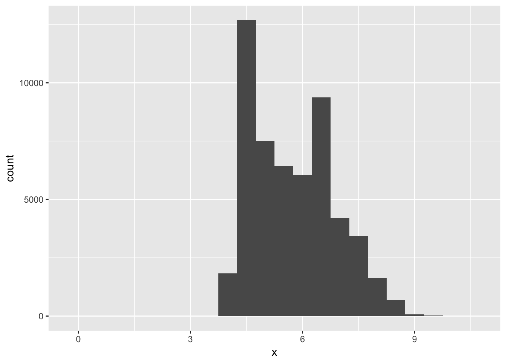
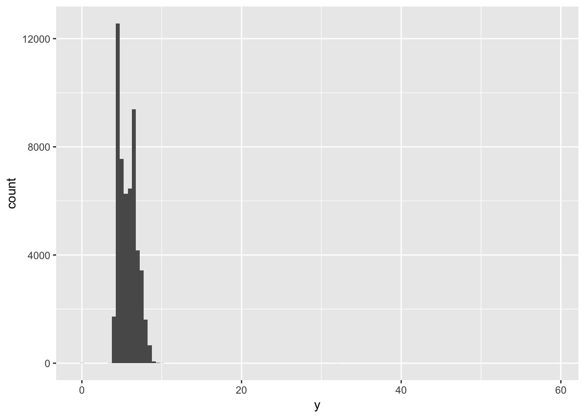
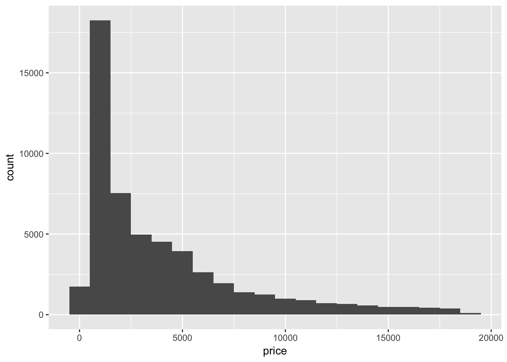
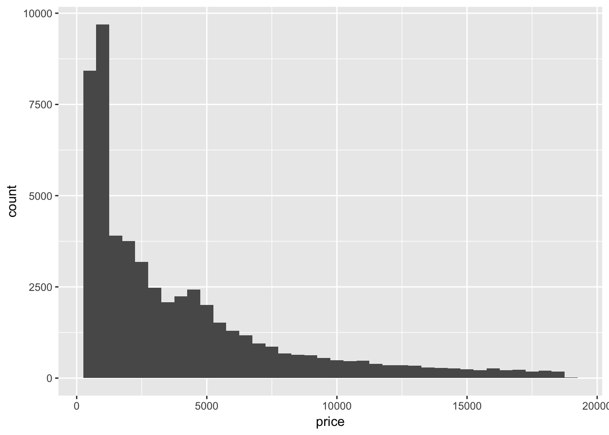
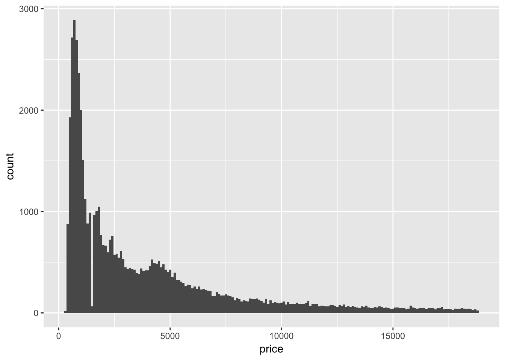
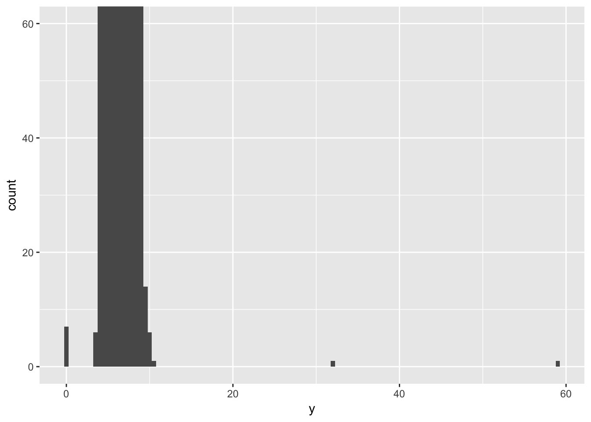
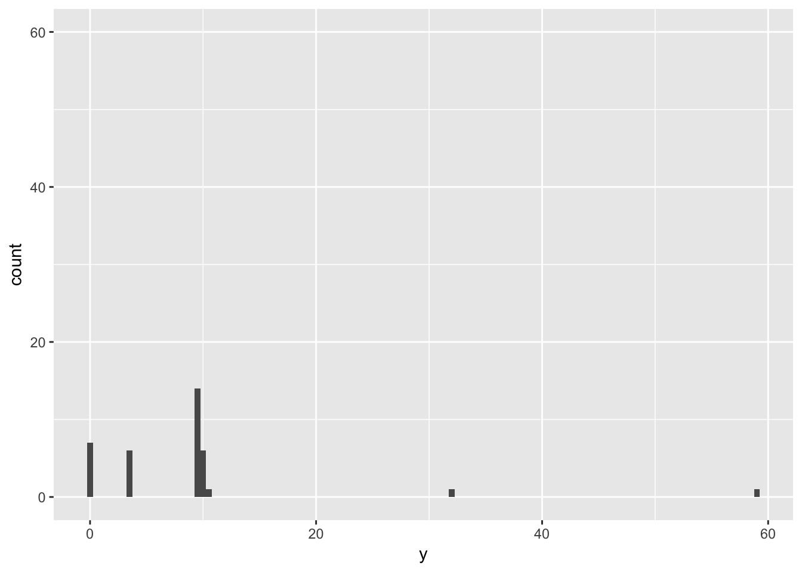

# Chapter 7 - Exploratory Data Analysis {-}

Load the libraries needed for these exercises.


```r
library(tidyverse)
```

## 7.3 - Variation {-}

### Problem 1 {-}

Explore the distribution of each of the `x`, `y`, and `z` variables in diamonds. 
What do you learn? Think about a diamond and how you might decide which 
dimension is the length, width, and depth.

The distribution of `x`, `y`, and `z` generally seems to fall between 0 and 
10mm, although the distributions of `y` and `z` both have much longer tails.


```r
ggplot(data = diamonds) + 
  geom_histogram(mapping = aes(x = x), binwidth = 0.5)
```




```r
ggplot(data = diamonds) + 
  geom_histogram(mapping = aes(x = y), binwidth = 0.5)
```




```r
ggplot(data = diamonds) + 
  geom_histogram(mapping = aes(x = z), binwidth = 0.5)
```


### Problem 2 {-}

Explore the distribution of `price`. Do you discover anything unusual or 
surprising? (Hint: Carefully think about the `binwidth` and make sure you try 
a wide range of values.)

The `price` of diamonds appears to peak around $2000, followed by a long tail
for the much more expensive diamonds. Narrowing the value of `binwidth` shows 
that some values are not very populated.


```r
ggplot(data = diamonds) + 
  geom_histogram(mapping = aes(x = price), binwidth = 1000)
```




```r
ggplot(data = diamonds) + 
  geom_histogram(mapping = aes(x = price), binwidth = 500)
```




```r
ggplot(data = diamonds) + 
  geom_histogram(mapping = aes(x = price), binwidth = 100)
```



### Problem 3 {-}

How many diamonds are 0.99 carat? How many are 1 carat? What do you think is 
the cause of the difference?

People may prefer to buy a diamond that is a full carat rather than almost a 
carat large. There appears to be significant rounding in the data set:


```r
diamonds %>%
  filter(between(carat, 0.99, 1.00)) %>%
  group_by(carat) %>%
  count()
```

```
## # A tibble: 2 x 2
## # Groups:   carat [2]
##   carat     n
##   <dbl> <int>
## 1  0.99    23
## 2  1.00  1558
```

### Problem 4 {-}

Compare and contrast `coord_cartesian()` vs `xlim()` or `ylim()` when zooming 
in on a histogram. What happens if you leave `binwidth` unset? What happens if 
you try and zoom so only half a bar shows?

Compare and contrast the following three graphs: while `coord_cartesian()` 
will preserve data, `ylim()` will drop rows that fall outside of the limits.


```r
ggplot(diamonds) + 
  geom_histogram(mapping = aes(x = y), binwidth = 0.5)
```


```r
ggplot(diamonds) + 
  geom_histogram(mapping = aes(x = y), binwidth = 0.5) +
  coord_cartesian(ylim = c(0,60))
```




```r
ggplot(diamonds) + 
  geom_histogram(mapping = aes(x = y), binwidth = 0.5) +
  ylim(0,60)
```

```
## Warning: Removed 11 rows containing missing values (geom_bar).
```


