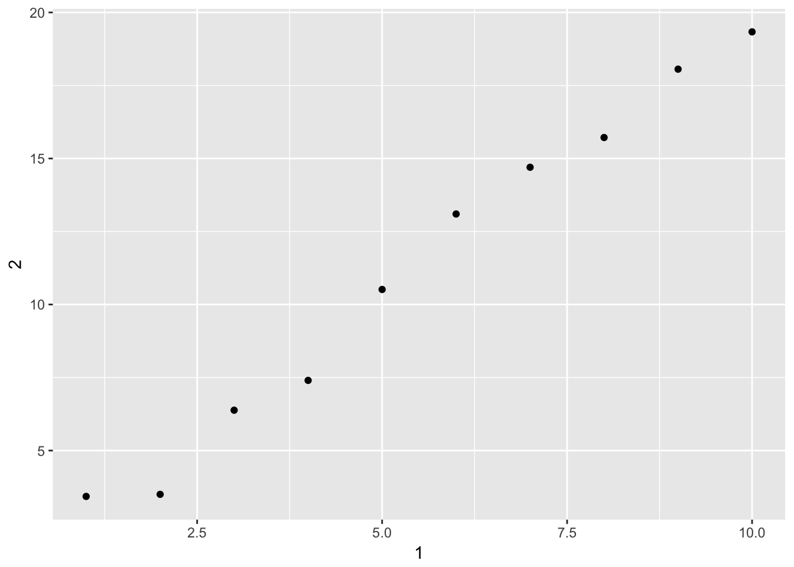

# Chapter 10 - Tibbles {-}

Load the libraries needed for these exercises.


```r
library(tidyverse)
```

## 10.5 - Exercises {-}

### Problem 1 {-}

How can you tell if an object is a tibble? (Hint: try printing `mtcars`, which 
is a regular data frame).

Use the `is.tibble()` function to determine if an object is a tibble. A tibble 
will also have a heading if printed to the console.


```r
is.tibble(mtcars)
```

```
## [1] FALSE
```

```r
is.tibble(diamonds)
```

```
## [1] TRUE
```

```r
diamonds
```

```
## # A tibble: 53,940 x 10
##    carat cut       color clarity depth table price     x     y     z
##    <dbl> <ord>     <ord> <ord>   <dbl> <dbl> <int> <dbl> <dbl> <dbl>
##  1 0.230 Ideal     E     SI2      61.5  55.0   326  3.95  3.98  2.43
##  2 0.210 Premium   E     SI1      59.8  61.0   326  3.89  3.84  2.31
##  3 0.230 Good      E     VS1      56.9  65.0   327  4.05  4.07  2.31
##  4 0.290 Premium   I     VS2      62.4  58.0   334  4.20  4.23  2.63
##  5 0.310 Good      J     SI2      63.3  58.0   335  4.34  4.35  2.75
##  6 0.240 Very Good J     VVS2     62.8  57.0   336  3.94  3.96  2.48
##  7 0.240 Very Good I     VVS1     62.3  57.0   336  3.95  3.98  2.47
##  8 0.260 Very Good H     SI1      61.9  55.0   337  4.07  4.11  2.53
##  9 0.220 Fair      E     VS2      65.1  61.0   337  3.87  3.78  2.49
## 10 0.230 Very Good H     VS1      59.4  61.0   338  4.00  4.05  2.39
## # ... with 53,930 more rows
```

### Problem 2 {-}

Compare and contrast the following operations on a `data.frame` and 
equivalent tibble. What is different? Why might the default data frame 
behaviours cause you frustration?

A data frame will attempt to auto-complete, while a tibble will not:


```r
df <- data.frame(abc = 1, xyz = "a")
tib <- tibble(abc = 1, xyz = "a")

df$x
```

```
## [1] a
## Levels: a
```

```r
tib$x
```

```
## Warning: Unknown or uninitialised column: 'x'.
```

```
## NULL
```

Data frames will sometimes simplify:


```r
is.data.frame(df[, "xyz"])
```

```
## [1] FALSE
```

```r
is.tibble(tib[, "xyz"])
```

```
## [1] TRUE
```

Tibble will display useful information on the data:


```r
df[, c("abc", "xyz")]
```

```
##   abc xyz
## 1   1   a
```

```r
tib[, c("abc", "xyz")]
```

```
## # A tibble: 1 x 2
##     abc xyz  
##   <dbl> <chr>
## 1  1.00 a
```


### Problem 3 {-}

If you have the name of a variable stored in an object, e.g. `var <- "mpg"`, 
how can you extract the reference variable from a tibble?

Use `[]` to extract the variable and `[[]]` to extract the vector:


```r
var <- 'mpg'
as.tibble(mtcars)[var]
```

```
## # A tibble: 32 x 1
##      mpg
##    <dbl>
##  1  21.0
##  2  21.0
##  3  22.8
##  4  21.4
##  5  18.7
##  6  18.1
##  7  14.3
##  8  24.4
##  9  22.8
## 10  19.2
## # ... with 22 more rows
```

```r
as.tibble(mtcars)[[var]]
```

```
##  [1] 21.0 21.0 22.8 21.4 18.7 18.1 14.3 24.4 22.8 19.2 17.8 16.4 17.3 15.2
## [15] 10.4 10.4 14.7 32.4 30.4 33.9 21.5 15.5 15.2 13.3 19.2 27.3 26.0 30.4
## [29] 15.8 19.7 15.0 21.4
```

### Problem 4 {-}

Practice referring to non-syntactic names in the following data frame by:

1. Extracting the variable called 1.


```r
annoying <- tibble(
  `1` = 1:10,
  `2` = `1` * 2 + rnorm(length(`1`))
)

annoying %>%
  select(`1`)
```

```
## # A tibble: 10 x 1
##      `1`
##    <int>
##  1     1
##  2     2
##  3     3
##  4     4
##  5     5
##  6     6
##  7     7
##  8     8
##  9     9
## 10    10
```


2. Plotting a scatterplot of 1 vs 2.


```r
ggplot(annoying, aes(`1`, `2`)) +
  geom_point()
```



3. Creating a new column called 3 which is 2 divided by 1.


```r
annoying <- annoying %>%
  mutate(`3` = `2` / `1`)
```


4. Renaming the columns to one, two and three.


```r
annoying %>%
  select(one = `1`,
         two = `2`,
         three = `3`)
```

```
## # A tibble: 10 x 3
##      one   two three
##    <int> <dbl> <dbl>
##  1     1  2.96  2.96
##  2     2  2.42  1.21
##  3     3  7.14  2.38
##  4     4  8.53  2.13
##  5     5 10.4   2.08
##  6     6 12.1   2.01
##  7     7 13.8   1.97
##  8     8 14.8   1.85
##  9     9 17.6   1.96
## 10    10 20.5   2.05
```

### Problem 5 {-}

What does `tibble::enframe()` do? When might you use it?

`enframe()` can be used to convert a vector or list to a tibble:


```r
enframe(c(a = 5,  b = 10))
```

```
## # A tibble: 2 x 2
##   name  value
##   <chr> <dbl>
## 1 a      5.00
## 2 b     10.0
```

### Problem 6 {-}

What option controls how many additional column names are printed at the 
footer of a tibble?

The `tibble.max_extra_cols` option controls this behavior, with a default of 
100.
