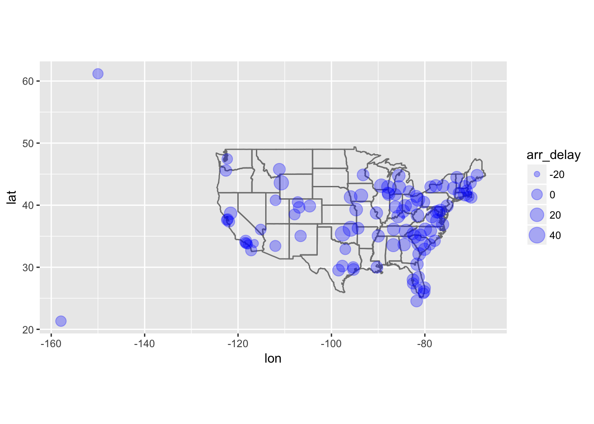
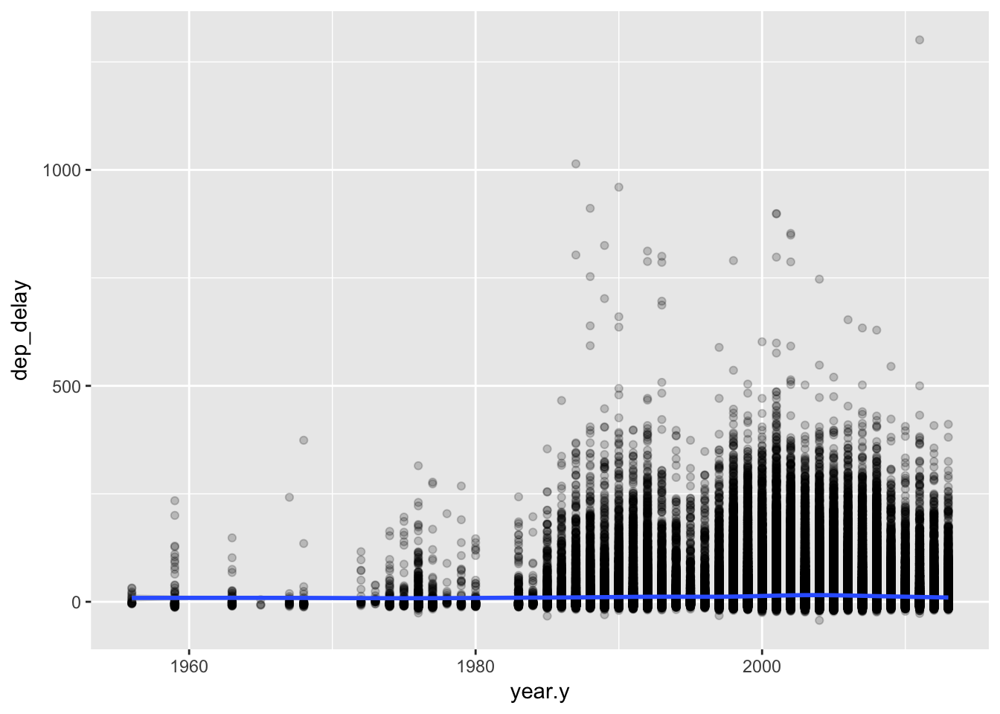
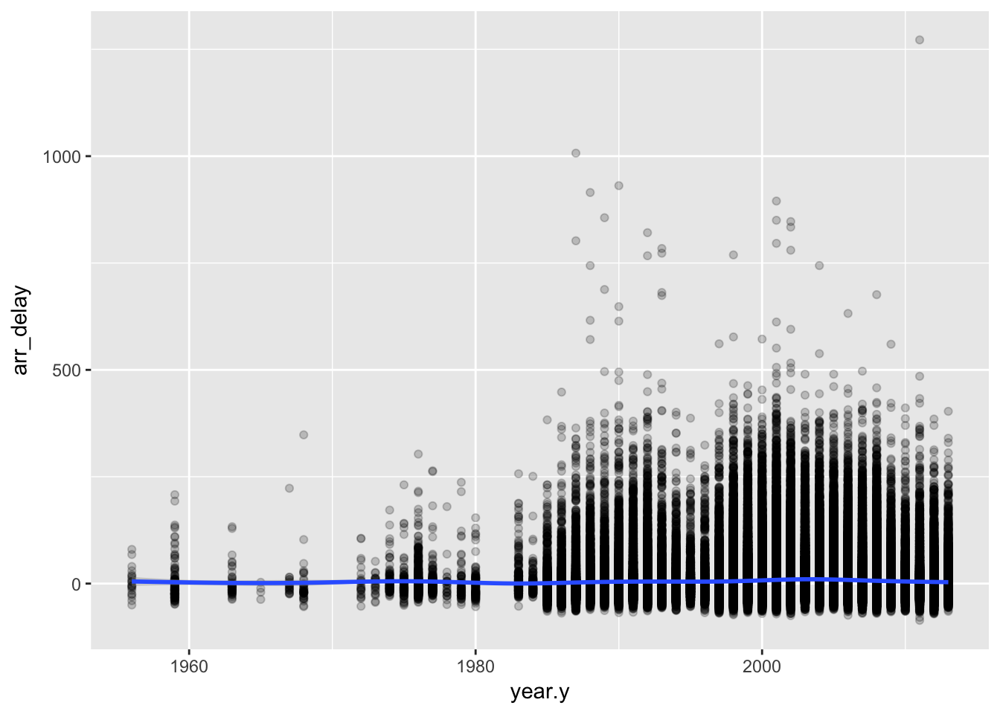

# Chapter 13 - Relational data {-}


```r
library(nycflights13)
library(tidyverse)
```

## 13.2 - nycflights13 {-}

### Problem 1 {-}

Imagine you wanted to draw (approximately) the route each plane flies from its origin to its destination. What variables would you need? What tables would you need to combine?

`Latitude` and `longitude` from the `airports` table and `origin` and `destination` from the `flights` table would be needed. 

### Problem 2 {-}

I forgot to draw the relationship between `weather` and `airports`. What is the relationship and how should it appear in the diagram?

The relationship is between `origin` from `weather` and `faa` from `airports`. It should be drawn as an arrow around the the flights table. 

### Problem 3 {-}

weather only contains information for the origin (NYC) airports. If it contained weather records for all airports in the USA, what additional relation would it define with flights?

Destination. 

### Problem 4 {-}

We know that some days of the year are “special”, and fewer people than usual fly on them. How might you represent that data as a data frame? What would be the primary keys of that table? How would it connect to the existing tables?

It would create a table of observations for days that are special that could relate to the flights table through `day`, `month`, and `year`. 

## 13.3 - Keys {-}

### Problem 1 {-}

Add a surrogate key to flights.


```r
flights %>%
  mutate(surrogate_key = row_number())
```

```
## # A tibble: 336,776 x 20
##     year month   day dep_time sched_dep_time dep_delay arr_time
##    <int> <int> <int>    <int>          <int>     <dbl>    <int>
##  1  2013     1     1      517            515      2.00      830
##  2  2013     1     1      533            529      4.00      850
##  3  2013     1     1      542            540      2.00      923
##  4  2013     1     1      544            545     -1.00     1004
##  5  2013     1     1      554            600     -6.00      812
##  6  2013     1     1      554            558     -4.00      740
##  7  2013     1     1      555            600     -5.00      913
##  8  2013     1     1      557            600     -3.00      709
##  9  2013     1     1      557            600     -3.00      838
## 10  2013     1     1      558            600     -2.00      753
## # ... with 336,766 more rows, and 13 more variables: sched_arr_time <int>,
## #   arr_delay <dbl>, carrier <chr>, flight <int>, tailnum <chr>,
## #   origin <chr>, dest <chr>, air_time <dbl>, distance <dbl>, hour <dbl>,
## #   minute <dbl>, time_hour <dttm>, surrogate_key <int>
```

### Problem 2 {-}

Identify the keys in the following datasets

Lahman::Batting
babynames::babynames 
nasaweather::atmos
fueleconomy::vehicles
ggplot2::diamonds
(You might need to install some packages and read some documentation.)

* `Lahman::Batting` - `playerID`, `yearID`, and `stint`


```r
library(Lahman)
Batting <- as_tibble(Batting)

Batting %>%
  count(playerID, yearID, stint) %>%
  filter(n > 1)
```

```
## # A tibble: 0 x 4
## # ... with 4 variables: playerID <chr>, yearID <int>, stint <int>, n <int>
```

* `babynames::babynames` 


```r
library(babynames)
babynames <- as_tibble(babynames)

babynames %>%
  count(year, sex, name) %>%
  filter(nn > 1)
```

```
## # A tibble: 0 x 4
## # ... with 4 variables: year <dbl>, sex <chr>, name <chr>, nn <int>
```

* `nasaweather::atmos` - `lat`, `long`, `year`, `month`


```r
library(nasaweather)
```

```
## 
## Attaching package: 'nasaweather'
```

```
## The following object is masked from 'package:dplyr':
## 
##     storms
```

```r
atmos <- as_tibble(atmos)

atmos %>%
  count(lat, long, year, month) %>%
  filter(n > 1)
```

```
## # A tibble: 0 x 5
## # ... with 5 variables: lat <dbl>, long <dbl>, year <int>, month <int>,
## #   n <int>
```

* `fueleconomy::vehicles` - 


```r
library(fueleconomy)
vehicles <- as_tibble(vehicles)

vehicles %>%
  count(id) %>%
  filter(n > 1)
```

```
## # A tibble: 0 x 2
## # ... with 2 variables: id <int>, n <int>
```

* `ggplot2::diamonds` - none!


```r
diamonds <- as_tibble(diamonds)

diamonds %>%
  count(carat, cut, color, clarity, depth, table, price, x, y, z) %>%
  filter(n > 1)
```

```
## # A tibble: 143 x 11
##    carat cut       color clarity depth table price     x     y     z     n
##    <dbl> <ord>     <ord> <ord>   <dbl> <dbl> <int> <dbl> <dbl> <dbl> <int>
##  1 0.300 Good      J     VS1      63.4  57.0   394  4.23  4.26  2.69     2
##  2 0.300 Very Good G     VS2      63.0  55.0   526  4.29  4.31  2.71     2
##  3 0.300 Very Good J     VS1      63.4  57.0   506  4.26  4.23  2.69     2
##  4 0.300 Premium   D     SI1      62.2  58.0   709  4.31  4.28  2.67     2
##  5 0.300 Ideal     G     VS2      63.0  55.0   675  4.31  4.29  2.71     2
##  6 0.300 Ideal     G     IF       62.1  55.0   863  4.32  4.35  2.69     2
##  7 0.300 Ideal     H     SI1      62.2  57.0   450  4.26  4.29  2.66     2
##  8 0.300 Ideal     H     SI1      62.2  57.0   450  4.27  4.28  2.66     2
##  9 0.310 Good      D     SI1      63.5  56.0   571  4.29  4.31  2.73     2
## 10 0.310 Very Good D     SI1      63.5  56.0   732  4.31  4.29  2.73     2
## # ... with 133 more rows
```

### Problem 3 {-}

Draw a diagram illustrating the connections between the Batting, Master, and Salaries tables in the Lahman package. Draw another diagram that shows the relationship between Master, Managers, AwardsManagers.

### Problem 4 {-}

How would you characterise the relationship between the Batting, Pitching, and Fielding tables?

## 13.4 - Mutating joins {-}

### Problem 1 {-}

Compute the average delay by destination, then join on the airports data frame so you can show the spatial distribution of delays. Here’s an easy way to draw a map of the United States:

```
airports %>%
  semi_join(flights, c("faa" = "dest")) %>%
  ggplot(aes(lon, lat)) +
    borders("state") +
    geom_point() +
    coord_quickmap()
(Don’t worry if you don’t understand what semi_join() does — you’ll learn about it next.)
```
You might want to use the size or colour of the points to display the average delay for each airport.


```r
flights %>%
  group_by(dest) %>%
  summarize(arr_delay = mean(arr_delay, na.rm = TRUE)) %>%
  left_join(airports, c("dest" = "faa")) %>%
  ggplot(aes(lon, lat, size = arr_delay), alpha = 0.5) +
    borders("state") +
    geom_point(alpha = 0.3, color = "blue") +
    coord_quickmap()
```

```
## 
## Attaching package: 'maps'
```

```
## The following object is masked from 'package:purrr':
## 
##     map
```

```
## Warning: Removed 5 rows containing missing values (geom_point).
```



### Problem 2 {-}

Add the location of the origin and destination (i.e. the lat and lon) to flights.


```r
airports2 <- airports %>%
  select(faa, lat, lon)

flights %>%
  left_join(airports2, c("origin" = "faa")) %>%
  rename(origin_lat = lat, origin_lon = lon) %>%
  left_join(airports2, c("dest" = "faa")) %>%
  rename(dest_lat = lat, dest_lon = lon)
```

```
## # A tibble: 336,776 x 23
##     year month   day dep_time sched_dep_time dep_delay arr_time
##    <int> <int> <int>    <int>          <int>     <dbl>    <int>
##  1  2013     1     1      517            515      2.00      830
##  2  2013     1     1      533            529      4.00      850
##  3  2013     1     1      542            540      2.00      923
##  4  2013     1     1      544            545     -1.00     1004
##  5  2013     1     1      554            600     -6.00      812
##  6  2013     1     1      554            558     -4.00      740
##  7  2013     1     1      555            600     -5.00      913
##  8  2013     1     1      557            600     -3.00      709
##  9  2013     1     1      557            600     -3.00      838
## 10  2013     1     1      558            600     -2.00      753
## # ... with 336,766 more rows, and 16 more variables: sched_arr_time <int>,
## #   arr_delay <dbl>, carrier <chr>, flight <int>, tailnum <chr>,
## #   origin <chr>, dest <chr>, air_time <dbl>, distance <dbl>, hour <dbl>,
## #   minute <dbl>, time_hour <dttm>, origin_lat <dbl>, origin_lon <dbl>,
## #   dest_lat <dbl>, dest_lon <dbl>
```

### Problem 3 {-}

Is there a relationship between the age of a plane and its delays?


```r
flights %>%
  left_join(planes, "tailnum") %>%
  ggplot(aes(year.y, dep_delay)) +
    geom_point(alpha = 0.2) +
    geom_smooth()
```

```
## `geom_smooth()` using method = 'gam'
```

```
## Warning: Removed 61980 rows containing non-finite values (stat_smooth).
```

```
## Warning: Removed 61980 rows containing missing values (geom_point).
```



```r
flights %>%
  left_join(planes, "tailnum") %>%
  ggplot(aes(year.y, arr_delay)) +
    geom_point(alpha = 0.2) +
    geom_smooth()
```

```
## `geom_smooth()` using method = 'gam'
```

```
## Warning: Removed 62923 rows containing non-finite values (stat_smooth).
```

```
## Warning: Removed 62923 rows containing missing values (geom_point).
```



### Problem 4 {-}

What weather conditions make it more likely to see a delay?


```r
flight_weather <- flights %>%
  left_join(weather, c("year", "month", "day", "hour", "origin")) %>%
  select(year, month, day, arr_delay, dep_delay, temp:visib, -wind_dir) %>%
  filter(complete.cases(.)) %>%
  mutate(arr_delay_categorical = cut_number(arr_delay, 5)) 

flight_weather %>%
  summarize_all(funs(sum(is.na(.))))
```

```
## # A tibble: 1 x 14
##    year month   day arr_delay dep_delay  temp  dewp humid wind_speed
##   <int> <int> <int>     <int>     <int> <int> <int> <int>      <int>
## 1     0     0     0         0         0     0     0     0          0
## # ... with 5 more variables: wind_gust <int>, precip <int>,
## #   pressure <int>, visib <int>, arr_delay_categorical <int>
```

```r
flight_means <- flight_weather %>%
  select(arr_delay_categorical, temp:visib) %>%
  group_by(arr_delay_categorical) %>%
  summarize_all(funs(mean(.)))

flight_means %>%
  gather(key = weather_type, value = value, -arr_delay_categorical) %>%
  ggplot(aes(arr_delay_categorical, value)) +
    geom_bar(stat = "identity") +
    facet_wrap(~weather_type, scales = "free")
```


```r
lm(arr_delay ~ dewp + humid + precip + pressure + temp + visib + wind_gust + wind_speed, data = flight_weather)
```

```
## 
## Call:
## lm(formula = arr_delay ~ dewp + humid + precip + pressure + temp + 
##     visib + wind_gust + wind_speed, data = flight_weather)
## 
## Coefficients:
## (Intercept)         dewp        humid       precip     pressure  
##   538.52374      0.85046     -0.44252     98.37679     -0.47439  
##        temp        visib    wind_gust   wind_speed  
##    -0.66531     -2.40736      0.08383           NA
```

### Problem 5 {-}

What happened on June 13 2013? Display the spatial pattern of delays, and then use Google to cross-reference with the weather.


```r
flight_weather <- flights %>%
  left_join(weather, c("year", "month", "day", "hour", "origin")) %>%
  select(year, month, day, arr_delay, dep_delay, temp:visib, -wind_dir) %>%
  filter(complete.cases(.)) %>%
  mutate(dep_delay_categorical = cut_number(dep_delay, 5)) 

airports2 <- airports %>%
  select(faa, lat, lon)

flight_airports <- flights %>%
  left_join(airports2, c("origin" = "faa")) %>%
  rename(origin_lat = lat, origin_lon = lon) %>%
  left_join(airports2, c("dest" = "faa")) %>%
  rename(dest_lat = lat, dest_lon = lon) %>%
  left_join(weather, c("year", "month", "day", "hour", "origin")) %>%
  filter(complete.cases(.)) %>%
  filter(month == 6 & day == 13)

flight_airports %>%
  ggplot(aes(dep_delay)) +
    geom_histogram()
```

```
## `stat_bin()` using `bins = 30`. Pick better value with `binwidth`.
```


```r
flight_airports %>%
  ggplot(aes(arr_delay)) +
    geom_histogram()
```

```
## `stat_bin()` using `bins = 30`. Pick better value with `binwidth`.
```


```r
flight_airports %>%
  ggplot(aes(dest_lon, dest_lat, size = dep_delay)) +
    borders("state") +
    geom_point(alpha = 0.2) +
    coord_quickmap()
```


Two derechos hit the United States East Coast on June 13, 2013. This caused significant departure delays at several airports. 

## 13.5 - Filtering joins {-}

### Problem 1 {-}

What does it mean for a flight to have a missing tailnum? What do the tail numbers that don’t have a matching record in planes have in common? (Hint: one variable explains ~90% of the problems.)


```r
planes <- as_tibble(planes)
flights <- as_tibble(flights)

no_tailnum <- flights %>%
  anti_join(planes, "tailnum") 

count(no_tailnum, carrier)
```

```
## # A tibble: 10 x 2
##    carrier     n
##    <chr>   <int>
##  1 9E       1044
##  2 AA      22558
##  3 B6        830
##  4 DL        110
##  5 F9         50
##  6 FL        187
##  7 MQ      25397
##  8 UA       1693
##  9 US        699
## 10 WN         38
```

```r
count(no_tailnum, origin)
```

```
## # A tibble: 3 x 2
##   origin     n
##   <chr>  <int>
## 1 EWR     5908
## 2 JFK    17137
## 3 LGA    29561
```

Departures from LaGuardia (LGA), JFK, and Newark (EWR) account for 100 percent of the planes without tail numbers. American Airlines (AA) and Envoy Airline (MQ) account for 90 percent of the planes without tail numbers. 

### Problem 2 {-}

Filter flights to only show flights with planes that have flown at least 100 flights.


```r
flights100 <- flights %>%
  group_by(tailnum) %>%
  count(tailnum) %>%
  filter(n >= 100)

semi_join(flights, flights100, "tailnum")
```

```
## # A tibble: 230,902 x 19
##     year month   day dep_time sched_dep_time dep_delay arr_time
##    <int> <int> <int>    <int>          <int>     <dbl>    <int>
##  1  2013     1     1      517            515      2.00      830
##  2  2013     1     1      533            529      4.00      850
##  3  2013     1     1      544            545     -1.00     1004
##  4  2013     1     1      554            558     -4.00      740
##  5  2013     1     1      555            600     -5.00      913
##  6  2013     1     1      557            600     -3.00      709
##  7  2013     1     1      557            600     -3.00      838
##  8  2013     1     1      558            600     -2.00      849
##  9  2013     1     1      558            600     -2.00      853
## 10  2013     1     1      558            600     -2.00      923
## # ... with 230,892 more rows, and 12 more variables: sched_arr_time <int>,
## #   arr_delay <dbl>, carrier <chr>, flight <int>, tailnum <chr>,
## #   origin <chr>, dest <chr>, air_time <dbl>, distance <dbl>, hour <dbl>,
## #   minute <dbl>, time_hour <dttm>
```

### Problem 3 {-}

Combine fueleconomy::vehicles and fueleconomy::common to find only the records for the most common models.


```r
library(fueleconomy)

semi_join(vehicles, common)
```

```
## Joining, by = c("make", "model")
```

```
## # A tibble: 14,531 x 12
##       id make  model  year class trans drive   cyl displ fuel    hwy   cty
##    <int> <chr> <chr> <int> <chr> <chr> <chr> <int> <dbl> <chr> <int> <int>
##  1  1833 Acura Inte…  1986 Subc… Auto… Fron…     4  1.60 Regu…    28    22
##  2  1834 Acura Inte…  1986 Subc… Manu… Fron…     4  1.60 Regu…    28    23
##  3  3037 Acura Inte…  1987 Subc… Auto… Fron…     4  1.60 Regu…    28    22
##  4  3038 Acura Inte…  1987 Subc… Manu… Fron…     4  1.60 Regu…    28    23
##  5  4183 Acura Inte…  1988 Subc… Auto… Fron…     4  1.60 Regu…    27    22
##  6  4184 Acura Inte…  1988 Subc… Manu… Fron…     4  1.60 Regu…    28    23
##  7  5303 Acura Inte…  1989 Subc… Auto… Fron…     4  1.60 Regu…    27    22
##  8  5304 Acura Inte…  1989 Subc… Manu… Fron…     4  1.60 Regu…    28    23
##  9  6442 Acura Inte…  1990 Subc… Auto… Fron…     4  1.80 Regu…    24    20
## 10  6443 Acura Inte…  1990 Subc… Manu… Fron…     4  1.80 Regu…    26    21
## # ... with 14,521 more rows
```

### Problem 4 {-}

Find the 48 hours (over the course of the whole year) that have the worst delays. Cross-reference it with the weather data. Can you see any patterns?


```r
daily_delay <- flights %>%
  filter(arr_delay > 0) %>%
  group_by(year, month, day) %>%
  summarize(arr_delay = sum(arr_delay, na.rm = TRUE)) %>%
  mutate(yesterday = arr_delay + lag(arr_delay),
         tomorrow = arr_delay + lead(arr_delay)) %>%
  ungroup() %>%
  filter(min_rank(-tomorrow) == 1 | min_rank(-yesterday) == 1) 
```

### Problem 5 {-}

What does anti_join(flights, airports, by = c("dest" = "faa")) tell you? What does anti_join(airports, flights, by = c("faa" = "dest")) tell you?

### Problem 6 {-}

You might expect that there’s an implicit relationship between plane and airline, because each plane is flown by a single airline. Confirm or reject this hypothesis using the tools you’ve learned above.
