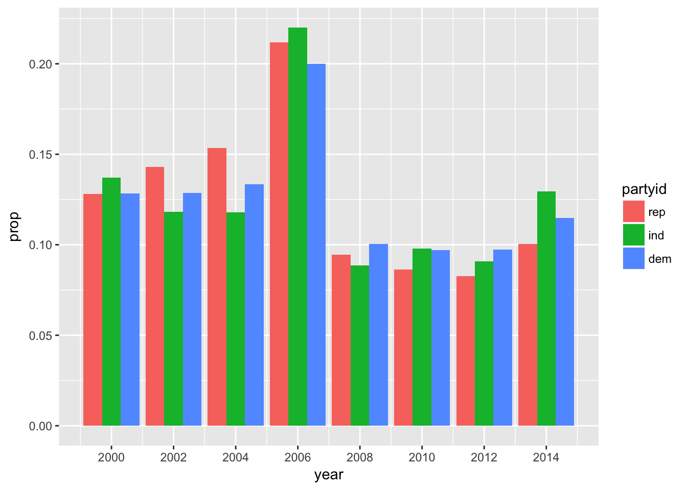

# Chapter 15 - Factors {-}


```r
library(tidyverse)
library(forcats)
```

## 15.3 - General Social Survey {-}

### Problem 1 {-}

Explore the distribution of `rincome` (reported income). What makes the default bar chart hard to understand? How could you improve the plot?

There are so many bars that the x-axis labels overlap.


```r
ggplot(gss_cat, aes(rincome)) +
  geom_bar()
```


Let's rotate the labels. 


```r
ggplot(gss_cat, aes(rincome)) +
  geom_bar() +
  theme(axis.text.x = element_text(angle=90))
```


### Problem 2 {-}

What is the most common `relig` in this survey? What's the most common `partyid`?


```r
gss_cat %>%
  count(relig) %>%
  top_n(1)
```

```
## # A tibble: 1 x 2
##   relig          n
##   <fct>      <int>
## 1 Protestant 10846
```


```r
gss_cat %>%
  count(partyid) %>%
  top_n(1)
```

```
## # A tibble: 1 x 2
##   partyid         n
##   <fct>       <int>
## 1 Independent  4119
```

### Problem 3 {-}

Which `relig` does `denom` apply to? How can you find out without a table? How can you find out with a vizualization?

`denom` applies to Protestant. 


```r
gss_cat %>%
  group_by(denom) %>%
  count(relig)
```

```
## # A tibble: 47 x 3
## # Groups:   denom [30]
##    denom           relig          n
##    <fct>           <fct>      <int>
##  1 No answer       No answer     93
##  2 No answer       Christian      2
##  3 No answer       Protestant    22
##  4 Don't know      Christian     11
##  5 Don't know      Protestant    41
##  6 No denomination Christian    452
##  7 No denomination Other          7
##  8 No denomination Protestant  1224
##  9 Other           Protestant  2534
## 10 Episcopal       Protestant   397
## # ... with 37 more rows
```


```r
gss_cat %>%
  group_by(relig, denom) %>%
  summarize(n = n()) %>%
  ggplot(aes(relig, denom, size = n)) +
    geom_point() +
    theme(axis.text.x=element_text(angle = 90))
```


## 15.4 - Modifying factor order {-}

### Problem 1 {-}

There are some conspicuously high numbers in `tvhours`. Is the mean a good summary?

Exteme values bias the mean. `tvhours` is skewed to the right and median may be a better summary statistic. 


```r
gss_cat %>%
  ggplot(aes(tvhours)) +
    geom_histogram()
```


```r
mean(gss_cat$tvhours, na.rm = TRUE)
```

```
## [1] 2.980771
```

```r
median(gss_cat$tvhours, na.rm = TRUE)
```

```
## [1] 2
```

### Problem 2 {-}

For each factor in `gss_cat` identify whether the order of the levels is arbitrary or principled. 

* `marital`: arbitrary
* `age`: principled
* `race`: arbitrary
* `rincome`: principled
* `partyid`: arbitrary
* `relig`: arbitrary
* `denom`: arbitrary

### Problem 3 {-}

Why did moving "Not Applicable" to the front of the levels move it to the bottom of the plot?

Factors are shown in reverse order from top to bottom when `coord_flip` is used. 


```r
gss_cat %>%
  mutate(race = fct_relevel(race, "Not applicable")) %>%
  ggplot(aes(race)) +
    geom_bar() +
    coord_flip() +
    scale_x_discrete(drop = FALSE)
```


## 15.5 - Modifying factor levels {-}

### Problem 1 {-}

How have the proportions of people identifying as Democrat, Republican, and Independent changed over time?


```r
gss_cat %>%
  mutate(partyid = fct_collapse(partyid,
    other = c("No answer", "Don't know", "Other party"),
    rep = c("Strong republican", "Not str republican"),
    ind = c("Ind,near rep", "Independent", "Ind,near dem"), 
    dem = c("Not str democrat", "Strong democrat"))) %>%
  filter(partyid != "other") %>%
  ggplot(aes(x = year, ..prop.., fill = partyid)) +
    geom_bar(position = "dodge") +
    scale_x_continuous(breaks = c(2000, 2002, 2004, 2006, 2008, 2010, 2012, 2014))
```



### Problem 2 {-}

How could you collapse `rincome` into a small set of categories?


```r
gss_cat %>%
  mutate(rincome = fct_collapse(rincome, 
    `More than $10,000` = c("$10000 - 14999", "$15000 - 19999", "$20000 - 24999", "$25000 or more"),
    `Less than $10,000` = c("Lt $1000", "$1000 to 2999", "$3000 to 3999", "$4000 to 4999", "$5000 to 5999", "$6000 to 6999", "$7000 to 7999", "$8000 to 9999"))) %>%
  mutate(rincome = fct_lump(rincome, n = 3)) %>%
  count(rincome, sort = TRUE)
```

```
## # A tibble: 4 x 2
##   rincome               n
##   <fct>             <int>
## 1 More than $10,000 10862
## 2 Not applicable     7043
## 3 Less than $10,000  2153
## 4 Other              1425
```
