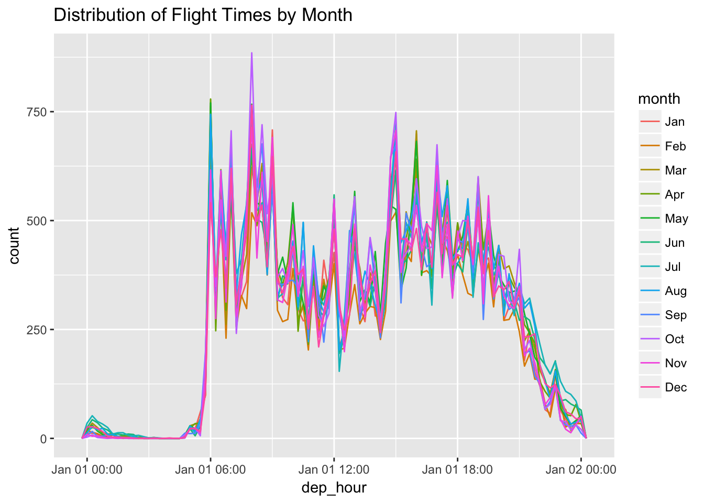
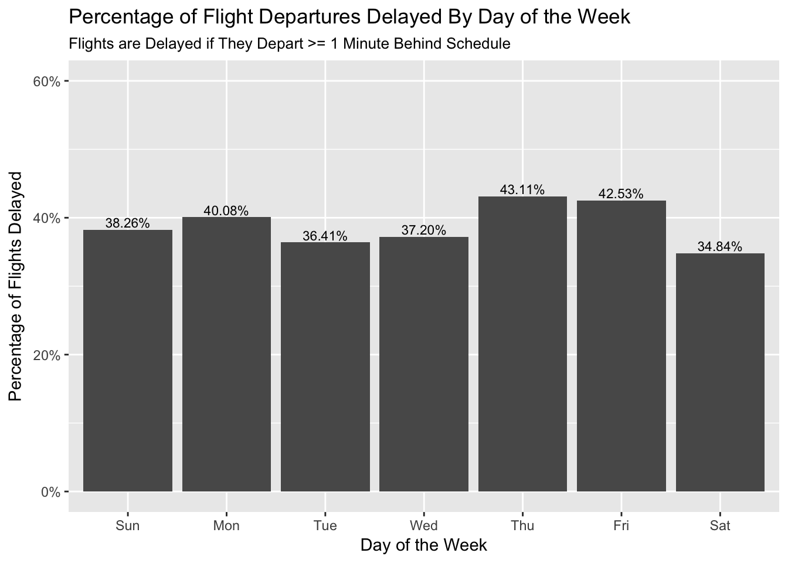
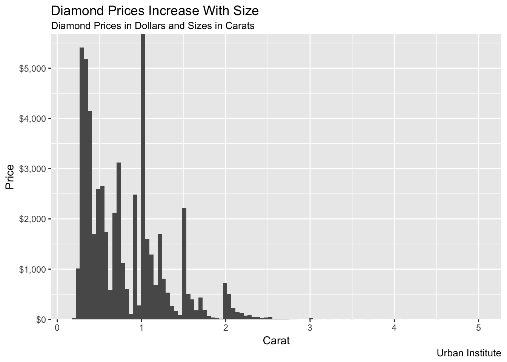
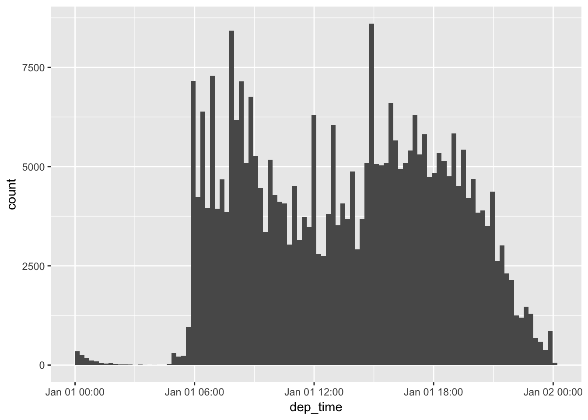
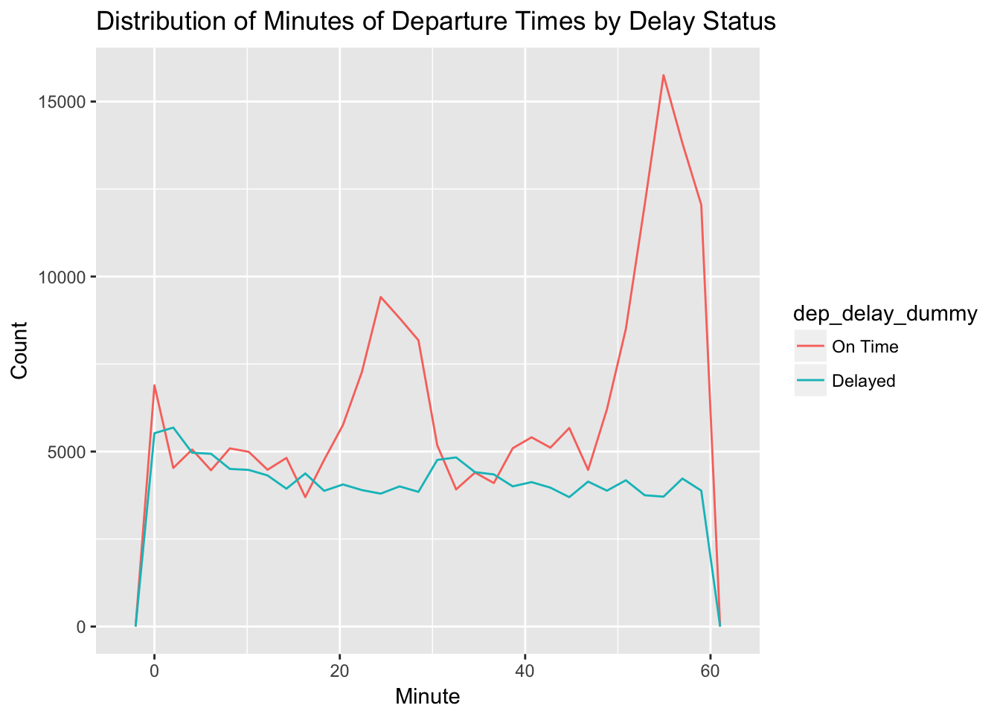

# Chapter 16 - Dates and times {-}

Load the libraries needed for these exercises.


```r
library(tidyverse)
library(lubridate)
library(nycflights13)
```

## 16.2 - Creating date/times {-}

### Problem 1 {-}

What happens if you parse a string that contains invalid dates? 


```r
ymd(c("2010-10-10", "bananas"))
```

```
## Warning: 1 failed to parse.
```

```
## [1] "2010-10-10" NA
```
Warning message: 1 failed to parse.

### Problem 2 {-}

What does the tzone argument to `today()` do? Why is it important?

tzone controls the time zone used when finding the current date. It defaults to the system time zone. It is important because every hour a different time zone moves from today to tomorrow and when analyzing data from another time zone dates can change. 

### Problem 3 {-}

Use the appropriate lubridate function to parse the following dates:


```r
d1 <- "January 1, 2010"
d2 <- "2015-Mar-07"
d3 <- "06-Jun-2017"
d4 <- c("August 19 (2015)", "July 1 (2015)")
d5 <- "12/30/14" # Dec 30, 2014

mdy(d1)
```

```
## [1] "2010-01-01"
```

```r
ymd(d2)
```

```
## [1] "2015-03-07"
```

```r
dmy(d3)
```

```
## [1] "2017-06-06"
```

```r
mdy(d4)
```

```
## [1] "2015-08-19" "2015-07-01"
```

```r
mdy(d5)
```

```
## [1] "2014-12-30"
```

## 16.3 - Date-time components {-}


```r
make_datetime_100 <- function(year, month, day, time) {
  make_datetime(year, month, day, time %/% 100, time %% 100)
}

flights_dt <- flights %>% 
  filter(!is.na(dep_time), !is.na(arr_time)) %>% 
  mutate(
    dep_time = make_datetime_100(year, month, day, dep_time),
    arr_time = make_datetime_100(year, month, day, arr_time),
    sched_dep_time = make_datetime_100(year, month, day, sched_dep_time),
    sched_arr_time = make_datetime_100(year, month, day, sched_arr_time)
  ) %>% 
  select(origin, dest, ends_with("delay"), ends_with("time"))
```

### Problem 1 {-}

How does the distribution of flight times within a day change over the course of the year?


```r
flights_dt %>%
  mutate(dep_hour = update(dep_time, yday = 1),
         month = month(dep_time, label = TRUE)) %>%
  ggplot(aes(dep_hour, color = month)) +
    geom_freqpoly(binwidth = 900) +
    labs(title = "Distribution of Flight Times by Month")
```



### Problem 2 {-}

Compare `dep_time`, `sched_dep_time`, and `dep_delay`. Are they consistent? Explain your findings. 

`dep_time`, `sched_dep_time`, and `dep_delay` are mostly consistent. The only issue is when delays extend past midnight. The value for day doesn't increase for `dep_time` when a a flight is delayed beyond its scheduled day. 


```r
flights_dt %>%
  mutate(dep_time2 = sched_dep_time + dep_delay * 60) %>%
  filter(dep_time != dep_time2) %>%
  select(sched_dep_time, dep_time, dep_time2)
```

```
## # A tibble: 1,205 x 3
##    sched_dep_time      dep_time            dep_time2          
##    <dttm>              <dttm>              <dttm>             
##  1 2013-01-01 18:35:00 2013-01-01 08:48:00 2013-01-02 08:48:00
##  2 2013-01-02 23:59:00 2013-01-02 00:42:00 2013-01-03 00:42:00
##  3 2013-01-02 22:50:00 2013-01-02 01:26:00 2013-01-03 01:26:00
##  4 2013-01-03 23:59:00 2013-01-03 00:32:00 2013-01-04 00:32:00
##  5 2013-01-03 21:45:00 2013-01-03 00:50:00 2013-01-04 00:50:00
##  6 2013-01-03 23:59:00 2013-01-03 02:35:00 2013-01-04 02:35:00
##  7 2013-01-04 23:59:00 2013-01-04 00:25:00 2013-01-05 00:25:00
##  8 2013-01-04 22:45:00 2013-01-04 01:06:00 2013-01-05 01:06:00
##  9 2013-01-05 23:59:00 2013-01-05 00:14:00 2013-01-06 00:14:00
## 10 2013-01-05 22:30:00 2013-01-05 00:37:00 2013-01-06 00:37:00
## # ... with 1,195 more rows
```

### Problem 3 {-}

Compare `air_time` with the duration between the departure and arrival. Explain your findings. (Hint: consider the location of the airport.)

TODO(aaron):

There is no way to explain my findings. 


```r
flights_dt %>%
  mutate(air_time_calc = as.numeric(arr_time - dep_time),
         air_time_diff = air_time - air_time_calc) %>%
  select(origin, dest, air_time, air_time_calc, air_time_diff)
```

```
## # A tibble: 328,063 x 5
##    origin dest  air_time air_time_calc air_time_diff
##    <chr>  <chr>    <dbl>         <dbl>         <dbl>
##  1 EWR    IAH        227           193            34
##  2 LGA    IAH        227           197            30
##  3 JFK    MIA        160           221           -61
##  4 JFK    BQN        183           260           -77
##  5 LGA    ATL        116           138           -22
##  6 EWR    ORD        150           106            44
##  7 EWR    FLL        158           198           -40
##  8 LGA    IAD         53            72           -19
##  9 JFK    MCO        140           161           -21
## 10 LGA    ORD        138           115            23
## # ... with 328,053 more rows
```

### Problem 4 {-}

How does the average delay time change over the course of a day? Should you use `dep_time` or `sched_dep_time`? Why?

The average delay time increases slightly over the course of a day. This makes sense. Events that delay flights, like weather, mechanical issues, and pilot flight limits, accumulate over the course of the day and increase the probability of a flight being delayed. 

`sched_dep_time` or `dep_time` could make sense. `sched_dep_time` is more useful if you're planning on scheduling a flight and want to avoid delays!


```r
flights_dt %>%
  mutate(sched_dep_time = update(sched_dep_time, yday = 1)) %>%
  ggplot(aes(sched_dep_time, dep_delay)) +
    geom_point(alpha = 0.05) +
    geom_smooth()
```


### Problem 5 {-}

On what day of the week should you leave if you want to minimize the chance of a delay?

Saturday boasts the lowest percentage of flights that have delayed departures and delayed arrivals. 


```r
flights_dt %>%
  mutate(day_of_week = wday(dep_time, label = TRUE),
         delayed = ifelse(dep_delay > 0, 1, 0)) %>%
  group_by(day_of_week) %>%
  summarize(delay_prob = mean(delayed)) %>%
  ggplot(aes(day_of_week, delay_prob)) +
    geom_bar(stat = "identity") +
    geom_text(aes(label = scales::percent(delay_prob)), vjust = -0.25, size = 3) +
    scale_y_continuous(labels = scales::percent, limits = c(0, 0.6)) +
    labs(title = "Percentage of Flight Departures Delayed By Day of the Week",
         subtitle = "Flights are Delayed if They Depart >= 1 Minute Behind Schedule", 
         x = "Day of the Week",
         y = "Percentage of Flights Delayed")
```




```r
flights_dt %>%
  mutate(day_of_week = wday(arr_time, label = TRUE),
         delayed = ifelse(arr_delay > 0, 1, 0)) %>%
  group_by(day_of_week) %>%
  summarize(delay_prob = mean(delayed, na.rm = TRUE)) %>%
  ggplot(aes(day_of_week, delay_prob)) +
    geom_bar(stat = "identity") +
    geom_text(aes(label = scales::percent(delay_prob)), vjust = -0.25, size = 3) +
    scale_y_continuous(labels = scales::percent, limits = c(0, 0.6)) +
    labs(title = "Percentage of Flight Arrivals Delayed By Day of the Week",
         subtitle = "Flights are Delayed if They Arrive >= 1 Minute Behind Schedule", 
         x = "Day of the Week",
         y = "Percentage of Flights Delayed")
```


### Problem 6 {-}

What makes the distribution of `diamonds$carat` and `flights_dep_time` similar?

Humans round. In the case of the diamonds, they always round up!


```r
ggplot(data = diamonds, mapping = aes(x = carat)) + 
  geom_histogram(bins = 100) + 
  scale_y_continuous(expand = c(0, 0), labels = scales::dollar) +
  labs(title = "Diamond Prices Increase With Size",
       subtitle = "Diamond Prices in Dollars and Sizes in Carats",
       caption = "Urban Institute",
       x = "Carat",
       y = "Price"
       )
```




```r
flights_dt %>%
  mutate(dep_time = update(dep_time, yday = 1)) %>%
  ggplot(aes(dep_time)) +
    geom_histogram(bins = 100)
```



### Problem 7 {-}

Confirm my hypothesis that the early departures of flights in minutes 20-30 and 50-60 are caused by scheduled flights that leave early. Hint: create a binary variable that tells whether or not the flight was delayed. 

Early departures of scheduled flights in minutes 20-30 and minutes 50-60 is definitely a contributing factor to the disuniform distribution of average delay times on page 245. 


```r
flights_dt %>%
  mutate(Minute = minute(dep_time),
         dep_delay_dummy = ifelse(dep_delay > 0, 1, 0),
         dep_delay_dummy = factor(dep_delay_dummy, labels = c("On Time", "Delayed"))) %>%
  ggplot(aes(Minute, color = dep_delay_dummy)) +
    geom_freqpoly() +
  labs(title = "Distribution of Minutes of Departure Times by Delay Status",
       y = "Count")
```



## 16.4 - Time spans {-}

### Problem 1 {-}

Why is there `months()` but no `dmonths()`?

Unlike hours, days, and weeks, the number of months in a year never varies. 

### Problem 2 {-}

Explain`days(overnight * 1)` to someone who has just started learning R. How does it work?

Overnight is a logical vector where `TRUE == 1` and `FALSE == 0`. If it's an overnight flight, `days()` add 23, 24, or 25 hours to the value depending on the day of the year. I am unsure why `* 1` is necessary. 

### Problem 3 {-}

Create a vector of dates giving the first day of every month in 2015. Create a vector of dates giving the first day of every month in the current year. 


```r
ymd("2015-01-01") + months(0:11)
```

```
##  [1] "2015-01-01" "2015-02-01" "2015-03-01" "2015-04-01" "2015-05-01"
##  [6] "2015-06-01" "2015-07-01" "2015-08-01" "2015-09-01" "2015-10-01"
## [11] "2015-11-01" "2015-12-01"
```

```r
floor_date(today(), unit = "year") + months(0:11)
```

```
##  [1] "2018-01-01" "2018-02-01" "2018-03-01" "2018-04-01" "2018-05-01"
##  [6] "2018-06-01" "2018-07-01" "2018-08-01" "2018-09-01" "2018-10-01"
## [11] "2018-11-01" "2018-12-01"
```

### Problem 4 {-}

Write a function that, given your birthday (as a date), returns how old you are in years. 


```r
age <- function(birthday) {
  (birthday %--% today()) / dyears(1)
}

age(ymd("1992-03-14"))
```

```
## [1] 26.2274
```

### Problem 5 {-}

Why can't `(today() %--% (today() + years(1)) / months(1)` work?

There is an uneven number of parentheses. 
