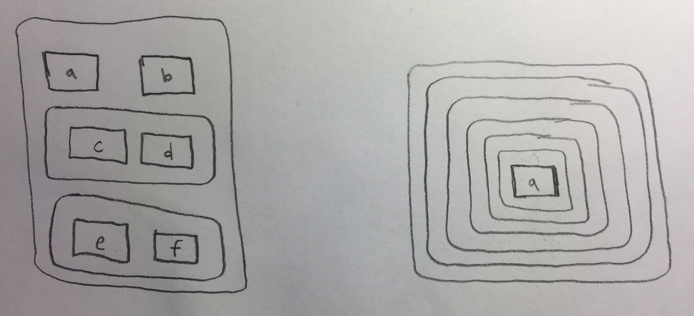

# Chapter 20 - Vectors {-}


```r
library(tidyverse)
```

## 20.3 - Important types of atomic vector {-}

### Problem 1 {-}

Describe the difference between `is.finite(x)` and `!is.infinite(x)`.

`is.finite(x)` returns `TRUE` for `NaN` and `NA`. `!is.infinite(x)` returns `FALSE` for `NaN` and `NA`. That's because both functions test for finite/infinite and not missing. `!` thus turns a `FALSE` from a missing value into a `TRUE`.


```r
is.finite(NaN)
```

```
## [1] FALSE
```

```r
!is.infinite(NaN)
```

```
## [1] TRUE
```

```r
is.finite(NA)
```

```
## [1] FALSE
```

```r
!is.infinite(NA)
```

```
## [1] TRUE
```

### Problem 2 {-}

Read the source code for `dplyr::near()` (Hint: to see the source code, drop the ()). How does it work?

It subtracts the first value from the second value and then sees if the difference is smaller than a tolerance of `.Machine$double.eps^0.5`. 

### Problem 3 {-}

A logical vector can take 3 possible values. How many possible values can an integer vector take? How many possible values can a double take? Use google to do some research.

R has 2147483647 positive integers, 2147483647 negative integers, `NA`, and `0L`. That sums up to 4.2949673\times 10^{9} possible values for integers. This numbers is ironically not an integer in R. 

The maximum double on this computer is 1.7976931\times 10^{308} and the minimum double on this computer is 1.7976931\times 10^{308}. This machine floats to 53. Double can also take the values `-Inf`, `Inf`, `NA`, and `NaN`. Doubles can approximately take `(.Machine$double.xmax * 2) * (10 ^ .Machine$double.digits) + 4` values. R can't actually display this number. 

### Problem 4 {-}

Brainstorm at least four functions that allow you to convert a double to an integer. How do they differ? Be precise.

todo(aaron): I can think of ways to truncate decimals. I can't think of ways to change the type of atomic vector. 


```r
2.2
```

```
## [1] 2.2
```

```r
as_integer <- function(x) {
  (x %/% 1)
}

typeof(as_integer(2.2))
```

```
## [1] "double"
```

```r
as_integer <- function(x) {
 x - x %% 1 
}

as_integer(2.2)
```

```
## [1] 2
```

```r
as_integer <- function(x) {
 round(x) 
}

as_integer(2.2)
```

```
## [1] 2
```

### Problem 5 {-}

What functions from the readr package allow you to turn a string into logical, integer, and double vector?

`parse_logical`, `parse_integer`, and `parse_number`

## 20.4 - Using atomic vectors {-}

### Problem 1 {-}

What does `mean(is.na(x))` tell you about a vector x? What about `sum(!is.finite(x))`?

`mean(is.na(x))` calculates the proportion of values in the vector that are missing. 

`sum(!is.finite(x))` calculates the number of values in the vector that are infinite, missing, or not a number.

### Problem 2 {-}

Carefully read the documentation of is.vector(). What does it actually test for? Why does is.atomic() not agree with the definition of atomic vectors above?

`is.vector()` tests if a vector is of the specified mode and has no attributes other than names. 

`is.atomic()` returns TRUE if the object is `NULL`. In "R for Data Science", `NULL` isn't considered a vector.

### Problem 3 {-}

Compare and contrast `setNames()` with `purrr::set_names()`.

`purrr::set_names()` is a snake case wrapper for `setNames()` with tweaked defaults and stricter argument checking. 

In particular, the argument `x` is unnamed and and comes first and names are named and come second in `purrr::set_names()`. Additionally, it tests to see if `x` is a vector. 

`purrr::set_names()` is now the same as `rlang::set_names()` so:

* If you do nothing, x will be named with itself.
* If x already has names, you can provide a function or formula to transform the existing names. In that case, ... is passed to the function.
* If nm is NULL, the names are removed (if present).
* In all other cases, nm and ... are coerced to character.

### Problem 4 {-}

Create functions that take a vector as input and returns:

The last value. Should you use [ or [[?

Use `[[` because it will always return only one value. 


```r
numbers <- c(1, 10, 93, 25, 43, NA, NA, 104, 10, NA, 25)

get_last <- function(x) {
 x[[length(x)]] 
}

get_last(numbers)
```

```
## [1] 25
```

The elements at even numbered positions.


```r
get_evens <- function(x) {
  index <- seq(from = 2, to = length(x), by = 2)
  x[index]
}

get_evens(numbers)
```

```
## [1]  10  25  NA 104  NA
```

Every element except the last value.


```r
get_all_but_last <- function(x) {
  index <- 1:(length(numbers) - 1)
  x[index]
}

get_all_but_last(numbers)
```

```
##  [1]   1  10  93  25  43  NA  NA 104  10  NA
```

Only even numbers (and no missing values).


```r
get_evens <- function(x) {
  index <- seq(from = 2, to = length(x), by = 2)
  
  evens <- x[index]
  
  evens[!is.na(evens)]
}

get_evens(numbers)
```

```
## [1]  10  25 104
```

### Problem 5 {-}

Why is `x[-which(x > 0)]` not the same as `x[x <= 0]`?

`x[-which(x > 0)]` returns `NaN` and `x[x <= 0]` does not return `NaN`. 

`which()` returns integers of the positions that meet the criteria and aren't `NaN`. Adding `-` to the index, drops the values meet the criteria and aren't `NaN`, but leaves the values that don't meet the criteria or are `NaN`. 

Conditionals return `NA` when tested against `NaN`, so `NaN` is dropped. This holds even if the opposite vector is used as an index. `!` changes `TRUE` to `FALSE` and `FALSE` to `TRUE` but it leaves `NA` as `NA`.


```r
x <- c(NA, -5, 10, 20, 0, NA, 10000, 10.1, NaN, Inf)

# 1
which(x > 0)
```

```
## [1]  3  4  7  8 10
```

```r
#2
-which(x > 0)
```

```
## [1]  -3  -4  -7  -8 -10
```

```r
#3
x[-which(x > 0)]
```

```
## [1]  NA  -5   0  NA NaN
```

```r
# 1
x <= 0
```

```
##  [1]    NA  TRUE FALSE FALSE  TRUE    NA FALSE FALSE    NA FALSE
```

```r
# 2
x[x <= 0]
```

```
## [1] NA -5  0 NA NA
```

### Problem 6 {-}

What happens when you subset with a positive integer that’s bigger than the length of the vector? What happens when you subset with a name that doesn’t exist?

The subset returns an `NA`. 


```r
x <- c(1, 2, 3)

x[5]
```

```
## [1] NA
```

The subset returns an `NA` with a name attribute of `NA`.


```r
x <- c(a = 1, b = 2, c = 3)

x["d"]
```

```
## <NA> 
##   NA
```

## 20.5 - Recursive vectors (lists) {-}

### Problem 1 {-}

Draw the following lists as nested sets:

1. `list(a, b, list(c, d), list(e, f))`
2. `list(list(list(list(list(list(a))))))`

{width=50%}

### Problem 2 {-}

What happens if you subset a tibble as if you’re subsetting a list? What are the key differences between a list and a tibble?

`[` returns a `tibble` with the referenced columns. `[[` returns a single vector with no attributes. 


```r
mtcars <- tbl_df(mtcars)

# tibble with just the first vector
mtcars[1]
```

```
## # A tibble: 32 x 1
##      mpg
##    <dbl>
##  1  21.0
##  2  21.0
##  3  22.8
##  4  21.4
##  5  18.7
##  6  18.1
##  7  14.3
##  8  24.4
##  9  22.8
## 10  19.2
## # ... with 22 more rows
```

```r
# vector with no attributes
mtcars[[1]]
```

```
##  [1] 21.0 21.0 22.8 21.4 18.7 18.1 14.3 24.4 22.8 19.2 17.8 16.4 17.3 15.2
## [15] 10.4 10.4 14.7 32.4 30.4 33.9 21.5 15.5 15.2 13.3 19.2 27.3 26.0 30.4
## [29] 15.8 19.7 15.0 21.4
```

A `tibble` is a list of columns. The difference between a tibble and a list is that all of the elemtns of a data frame must be vectors of the same length while lists can have elements of different lengths. 

## 20.7 - Augmented vectors {-}

### Problem 1 {-}

What does `hms::hms(3600)` return? How does it print? What primitive type is the augmented vector built on top of? What attributes does it use?

It returns a vector with classes "hms" and "difftime". The primitive type is double. It has attributes `$units` and `$class`.

### Problem 2 {-}

Try and make a tibble that has columns with different lengths. What happens?

It returns an error: "Error: Column `a` must be length 1 or 5, not 3"


```r
tibble(a = 1:3,
       b = 1:5)
```

### Problem 3 {-}

Based on the definition above, is it ok to have a list as a column of a tibble?

Yes. <list> columns are an important feature of tibbles. 


```r
tibble(a = list(c(1, 2, 3), c(1, 3), 1),
       b = 1:3)
```

```
## # A tibble: 3 x 2
##   a             b
##   <list>    <int>
## 1 <dbl [3]>     1
## 2 <dbl [2]>     2
## 3 <dbl [1]>     3
```


